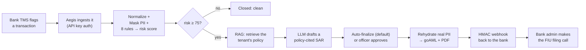
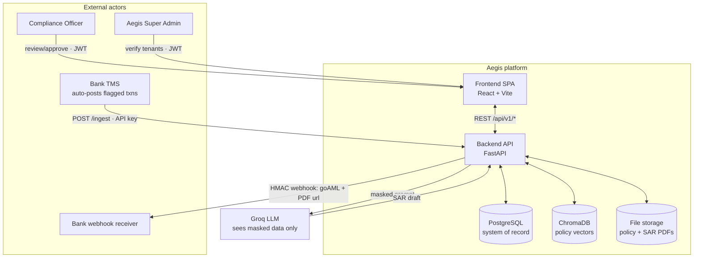
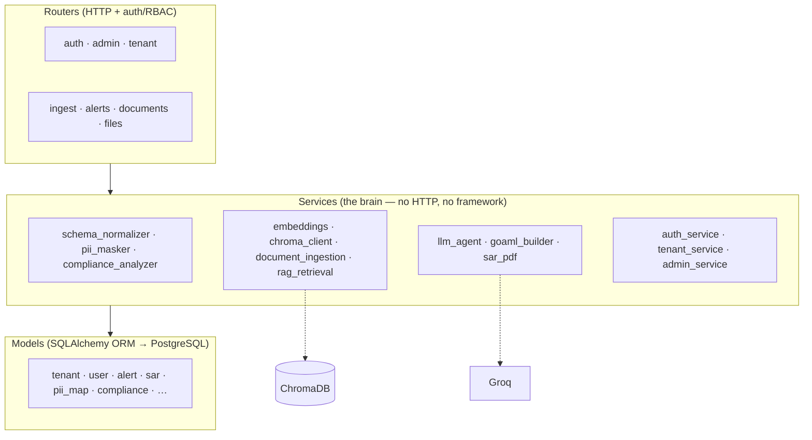
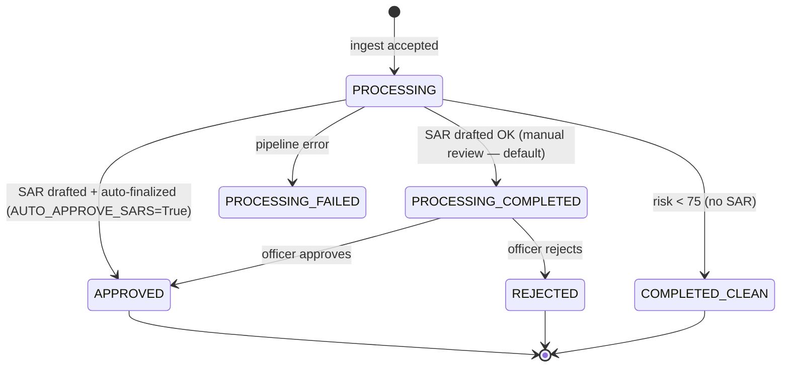
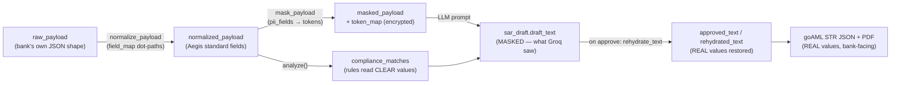
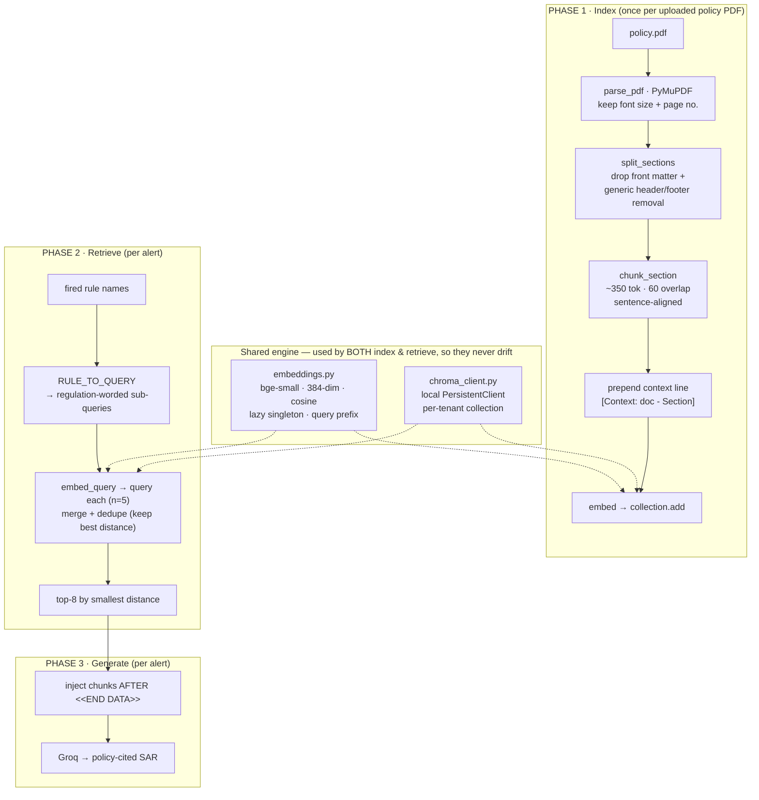
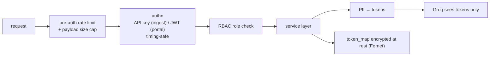
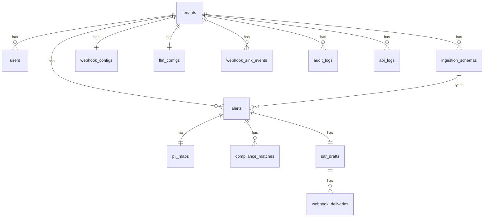
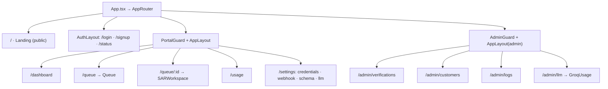
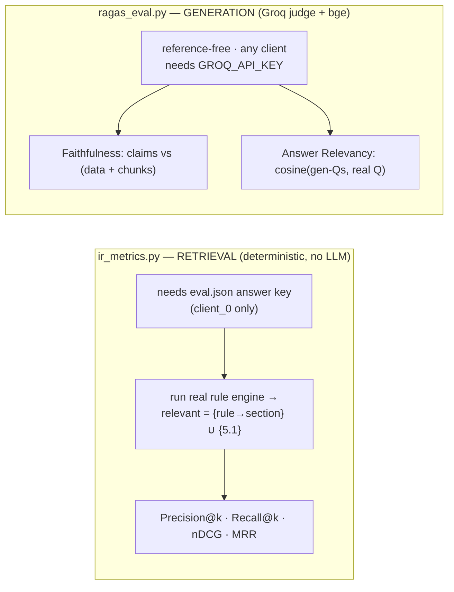

<div align="center">

# Aegis AML — Master Knowledge Base

**The single, authoritative, code-verified reference for the entire project.**

`Status: Functional MVP` · `Stack: FastAPI · PostgreSQL · ChromaDB · React/Vite · Groq LLM`
`Last verified against source: 2026-06-29` · `Live loop re-verified 2026-06-29 — verify_stack 27/27`

</div>

---

## How to use this document

This file is a **knowledge graph of the system as it actually exists in code today**. It was
written so that a newcomer — human or AI agent — can understand *what the system does, how
every part connects, and where each thing lives* **without reading the source first**.

> **→ If you are an AI agent picking up this project: READ THIS FILE FIRST**, then drill into
> the deep docs in the source-of-truth hierarchy below. For the current state and the most
> recent changes, jump to [§22 — Project status](#22-project-status). The teammate-facing
> mock-bank build spec lives in [`MOCKBANK_BRIEF.md`](MOCKBANK_BRIEF.md).

| If you want to… | Go to |
|---|---|
| Understand what Aegis is in 60 seconds | [§1](#1-what-aegis-is) · [§2](#2-the-mental-model) |
| Follow one transaction end-to-end | [§5 — Alert lifecycle](#5-the-alert-lifecycle-the-core-flow) |
| See how a field is transformed at each stage | [§6.4 — Field-by-field data flow](#64-the-data-traced-field-by-field) |
| Understand the AI / RAG part | [§7 — RAG subsystem](#7-the-rag-subsystem) · [§8 — SAR generation](#8-sar-generation-the-llm--llm_agentpy) |
| Find an API endpoint | [§13 — API reference](#13-api-reference-verified-from-routers) |
| See real request/response shapes | [Appendix A — API contracts](#appendix-a--api-contracts-real-shapes) |
| See every DB column & type | [Appendix B — Data dictionary](#appendix-b--data-dictionary-column-level) |
| Understand each UI screen | [§14.1 — Screen-by-screen](#141-screen-by-screen) |
| Open the interactive visual map | [`AEGIS_KNOWLEDGE_BASE.html`](AEGIS_KNOWLEDGE_BASE.html) — open in any browser |
| Find which file does what | [§20 — Component index](#20-component-index-file-by-file) |
| Know what's done vs. pending | [§22 — Project status](#22-project-status) |
| Know which existing docs to trust | [§21 — Document map](#21-document-map--accuracy-notes) |

**Conventions used here**

- Status markers used in this document: **Built** (built and verified) · **Deferred** (designed, not built) · **Note** (caveat / gotcha) · **Security** (security control).
- Code paths are written like [`backend/app/routers/ingest.py`](backend/app/routers/ingest.py).
- **The code is the source of truth.** Where older docs disagree, this file follows the code
  and flags the difference in [§21](#21-document-map--accuracy-notes).

**Source-of-truth hierarchy for the wider repo**

1. **This file** — orientation + the accurate, cross-cutting map.
2. [`PROJECT_REFERENCE.md`](PROJECT_REFERENCE.md) — deep narrative on RAG + security reasoning.
3. [`STATUS_AND_MOCKBANK.md`](STATUS_AND_MOCKBANK.md) — current status + the mock-bank integration brief.
4. [`DatabaseSchema.md`](DatabaseSchema.md) — the SQL/table contract.
5. [`APISpec.md`](APISpec.md) — original API design (Note: several paths are stale; see §21).
6. [`MOCKBANK_BRIEF.md`](MOCKBANK_BRIEF.md) — standalone brief for the teammate building the mock
   bank (build spec, AML rule engine, integration contract, copy-paste code).

*(`RAG_MASTER.md` was **deleted** 2026-06-29 — fully superseded by this file + `PROJECT_REFERENCE.md`.)*

---

## Table of contents

**Part I · Orientation**
1. [What Aegis is](#1-what-aegis-is)
2. [The mental model](#2-the-mental-model)
3. [Glossary](#3-glossary)

**Part II · How it works**
4. [System architecture](#4-system-architecture)
5. [The alert lifecycle (the core flow)](#5-the-alert-lifecycle-the-core-flow)
6. [The AML pipeline, stage by stage](#6-the-aml-pipeline-stage-by-stage) · [6.4 Field-by-field data flow](#64-the-data-traced-field-by-field)
7. [The RAG subsystem](#7-the-rag-subsystem)
8. [SAR generation (the LLM)](#8-sar-generation-the-llm--llm_agentpy)
9. [Approval, goAML & webhook delivery](#9-approval-goaml--webhook-delivery--routersalertspy)

**Part III · The platform**
10. [Multi-tenancy & isolation](#10-multi-tenancy--isolation)
11. [Security architecture & threat model](#11-security-architecture--threat-model)
12. [Data model](#12-data-model)
13. [API reference (verified from routers)](#13-api-reference-verified-from-routers)
14. [Frontend](#14-frontend)

**Part IV · Operations**
15. [Storage layout](#15-storage-layout)
16. [Configuration & secrets](#16-configuration--secrets)
17. [Running the system](#17-running-the-system)
18. [Evaluation](#18-evaluation)
19. [Scripts reference](#19-scripts-reference)

**Part V · Reference & meta**
20. [Component index (file by file)](#20-component-index-file-by-file)
21. [Document map & accuracy notes](#21-document-map--accuracy-notes)
22. [Project status](#22-project-status)

**Part VI · Appendices**
- [Appendix A — API contracts (real shapes)](#appendix-a--api-contracts-real-shapes)
- [Appendix B — Data dictionary (column-level)](#appendix-b--data-dictionary-column-level)

---
---

# Part I · Orientation

## 1. What Aegis is

**Aegis AML is a B2B SaaS that automatically drafts Suspicious Activity Reports (SARs) for
Indian fintechs and brokers.**

Under India's anti-money-laundering law (PMLA), regulated financial institutions must file a
**Suspicious Transaction Report (STR/SAR)** with **FIU-India** whenever they detect a
suspicious transaction. Writing these reports by hand is slow, repetitive, and error-prone.
Aegis automates the drafting while keeping a human compliance officer in control of approval.

**The value proposition in one line:** a bank sends Aegis a flagged transaction, and Aegis
returns a regulator-ready, **policy-cited** SAR — with all customer PII protected throughout.

What makes the SAR trustworthy:

- **It cites the tenant's own AML policy** (via RAG), not generic LLM knowledge — so the
  report references *“Section 4.1”* of the bank's actual policy, not vague prose.
- **Personal data never reaches the AI.** PII is tokenized before any LLM call and only
  restored locally, at finalization.
- **A human reviews and approves every SAR before it leaves Aegis.** By default
  (`AUTO_APPROVE_SARS=False`) a drafted SAR waits in the officer's SAR Workspace as
  `PENDING_REVIEW`; a compliance officer reads it, optionally edits, and **approves** — only then
  is it finalized and delivered to the bank (where the bank's admin makes the final file-with-FIU
  call). Setting the flag to `True` auto-finalizes and delivers immediately, leaving the sole
  human gate at the bank. Two-layer human oversight either way.

## 2. The mental model

Aegis is a pipeline wrapped in a multi-tenant SaaS. The heart of it is a single loop:

> **Transaction → Normalize → Mask PII → Score with rules → (if risky) Retrieve policy + Generate cited SAR → Auto-finalize (default) → Rehydrate PII → Deliver goAML + PDF to the bank → bank admin makes the filing call.**



Three principles to keep in mind everywhere:

1. **The customer never sees a SAR.** Reports flow bank → Aegis → bank → regulator only.
   Informing the customer is *“tipping-off,”* which is illegal.
2. **PII is masked before any external call** and rehydrated only at approval. Groq (the LLM)
   only ever sees tokens like `USR_a1b2c3d4`.
3. **Everything is local except the LLM.** Embeddings and vector search run offline (bge +
   ChromaDB). Groq is the only external AI dependency.

## 3. Glossary

| Term | Meaning |
|---|---|
| **SAR / STR** | Suspicious Activity / Transaction Report — the legal filing. The product's output. |
| **FIU-India** | Financial Intelligence Unit of India — the regulator that receives STRs. |
| **PMLA** | Prevention of Money Laundering Act — the law mandating STR filing. |
| **goAML** | The standard schema STRs are filed in. Aegis emits the report as JSON *and* goAML-aligned XML (well-formed, FIU-IND `<report>` structure; XSD certification pending). |
| **Tenant** | One B2B customer (a fintech/broker). Everything is scoped per tenant. Public id `TEN-XXXX`. |
| **Alert** | One flagged transaction ingested from a tenant. The central unit of work. |
| **TMS** | Transaction Monitoring System — the bank's software that flags transactions. |
| **PII** | Personally Identifiable Information (names, accounts, IPs…). Masked before AI. |
| **Masking / Rehydration** | Replacing PII with deterministic tokens, then restoring real values at approval. |
| **RAG** | Retrieval-Augmented Generation: retrieve policy chunks → augment the prompt → generate a cited SAR. |
| **Embedding** | A 384-number vector capturing text meaning; similar meaning ⇒ similar direction (cosine). |
| **bge** | `BAAI/bge-small-en-v1.5`, the local sentence-transformer encoder (offline, free). |
| **ChromaDB** | The local, file-based vector database holding per-tenant policy vectors. |
| **Groq** | The LLM inference provider (hosts Llama-3.3-70B). The only external AI call. |
| **`client_0`** | The dummy/offline test tenant (synthetic policy + 5 labeled alerts + answer key). |
| **IR metrics** | Deterministic retrieval-quality scores (Precision/Recall/nDCG/MRR), no LLM. |
| **RAGAS** | Generation-quality scores (Faithfulness, Answer Relevancy) judged by an LLM. |

---
---

# Part II · How it works

## 4. System architecture

### 4.1 Context — who talks to what



### 4.2 Layered backend — how a request flows internally

The backend is a clean three-layer FastAPI app: **routers → services → models**.



- **Routers** ([`backend/app/routers/`](backend/app/routers/)) handle HTTP, authentication,
  RBAC (via FastAPI `Depends`), and request validation. They contain no business logic.
- **Services** ([`backend/app/services/`](backend/app/services/)) are the brain — pure Python,
  framework-agnostic, independently testable. This is where the pipeline lives.
- **Models** ([`backend/app/models/`](backend/app/models/)) are the ORM tables (see §12).

This separation is deliberate: the entire pipeline (services) can run from a script with no
HTTP server — which is exactly how the offline eval and demos work.

## 5. The alert lifecycle (the core flow)

This is the most important section. It traces one transaction from arrival to delivery.
Source: [`routers/ingest.py`](backend/app/routers/ingest.py) and
[`routers/alerts.py`](backend/app/routers/alerts.py).

```mermaid
sequenceDiagram
    autonumber
    participant Bank as Bank TMS
    participant API as POST /api/v1/ingest/
    participant BG as Background task
    participant DB as PostgreSQL
    participant RAG as RAG (Chroma + bge)
    participant LLM as Groq
    participant Off as Officer (dashboard)
    participant Hook as Bank webhook

    Note over API: Security — rate-limit + size cap + API-key auth (pre-checks)
    Bank->>API: txn JSON + X-API-Key + X-Tenant-ID
    API->>API: idempotency check (key or body hash)
    API->>API: 1 · normalize (tenant field_map)
    API->>API: 2 · mask PII (deterministic tokens)
    API->>API: 3 · run 8 rules → composite risk score
    API->>DB: persist Alert + PIIMap + ComplianceMatches

    alt risk ≥ 75
        API-->>Bank: 200 · {alert_id, risk_score, "SAR triggered"}
        API->>BG: schedule process_alert_background(alert_id)
        BG->>RAG: 4a · retrieve policy chunks (fired rules → queries)
        RAG-->>BG: top-8 chunks (or none → degrade gracefully)
        BG->>LLM: 4b · generate SAR (masked data + chunks + rules)
        LLM-->>BG: narrative + structured JSON (cited)
        BG->>DB: store SARDraft (masked)
        alt AUTO_APPROVE_SARS = True (default)
            BG->>BG: 5 · finalize_and_deliver — rehydrate PII → goAML STR → PDF (in-memory)
            BG->>Hook: Security — HMAC-signed webhook {goaml_str, pdf_base64, pdf_url}
            BG->>DB: status APPROVED + WebhookSinkEvent (audit)
            Note over Hook: bank admin reviews & makes the FIU filing call
        else AUTO_APPROVE_SARS = False (manual mode)
            BG->>DB: status PROCESSING_COMPLETED (pending officer review)
            Off->>API: GET /alerts/queue → review item
            opt edit / preview
                Off->>API: PUT /queue/{id}/draft (edit narrative)
                Off->>API: GET /queue/{id}/preview-rehydrated (see real PII)
            end
            Off->>API: POST /alerts/queue/{id}/approve
            API->>API: finalize_and_deliver — rehydrate PII → goAML STR → PDF (in-memory)
            API->>Hook: Security — HMAC-signed webhook {goaml_str, pdf_base64, pdf_url}
            API->>DB: status APPROVED + WebhookSinkEvent (audit)
            API-->>Off: 200 · {approved_at}
        end
    else risk < 75
        API-->>Bank: 200 · {alert_id, risk_score, "no SAR required"}
        API->>DB: status COMPLETED_CLEAN
    end
```

### Alert status state machine

These are the **actual status strings** used in code. The API maps the internal names to
friendlier public names for the UI (see the note below).



**Note — Status name translation.** [`routers/alerts.py`](backend/app/routers/alerts.py) maps
internal → public statuses for the frontend: `PROCESSING_COMPLETED → PENDING_REVIEW` and
`PENDING_INGESTION → PROCESSING`. So an alert the DB calls `PROCESSING_COMPLETED` appears in
the UI as `PENDING_REVIEW`.

## 6. The AML pipeline, stage by stage

The synchronous stages (1–3) run inside the ingest request; SAR generation (4) runs in a
background task. Each stage is one service.

### Stage 1 — Normalize · [`schema_normalizer.py`](backend/app/services/schema_normalizer.py)

Every tenant sends a different JSON shape. The tenant's active **ingestion schema** carries a
`field_map` of *Aegis standard field → dot-path into the raw payload*. Normalization is a
simple, safe dot-path extraction:

```python
normalize_payload(raw, field_map)  # {"customer_name": raw["customer"]["full_name"], ...}
```

There are **three preset schemas** ([`data/schema_presets.py`](backend/app/data/schema_presets.py)),
so the same downstream code handles any client type:

| Schema key | Client type | “customer name” path | “amount” path |
|---|---|---|---|
| `STANDARD_FINTECH` | wallets / payment apps (used by `TEN-0001`) | `customer.full_name` | `txn.amount` |
| `SEBI_BROKER` | stock brokers (PAN / Demat) | `client.name` | `trade.value` |
| `PAYMENT_GW` | payment gateways (UPI VPA) | `payer.name` | `txn.amount` |

### Stage 2 — Mask PII · [`pii_masker.py`](backend/app/services/pii_masker.py)

Each field listed in the schema's `pii_fields` is replaced by a **deterministic token**:
`<PREFIX><first-8-hex-of-SHA256(value)>`. Determinism means the same entity yields the same
token across transactions, so the LLM can reason about linkage *without ever seeing identity*.

| Field(s) | Prefix | Example |
|---|---|---|
| `customer_name`, `counterparty_name` | `USR_` | `USR_a1b2c3d4` |
| `account_id`, `counterparty_account` | `ACC_` | `ACC_e5f6a7b8` |
| `customer_id` | `CID_` | `CID_9a8b7c6d` |
| `ip_address` | `IP_` | `IP_1122aabb` |
| `device_id` | `DEV_` | `DEV_ffee0011` |
| anything else | `TOK_` | `TOK_…` |

The `token_map` (token → real value) is saved in the `pii_maps` table **encrypted at rest**
(Fernet). `rehydrate_text()` reverses the mapping and is called **only** on approval and in the
preview endpoint.

### Stage 3 — Compliance rules & scoring · [`compliance_analyzer.py`](backend/app/services/compliance_analyzer.py)

Eight deterministic typology checks run on the normalized payload. They produce **factual
evidence** (field + value + plain-English explanation) so the LLM never has to invent *why* a
transaction is suspicious. All numeric inputs are coerced safely first, so crafted payloads
(`{"transaction_amount": "N/A"}`) can never crash ingestion.

| `rule_id` | Name | Triggers when | Confidence |
|---|---|---|---|
| `STRUCTURING` | Structuring / Smurfing | amount ∈ **₹800,000–999,999** (just below the ₹10L threshold) | HIGH if ≥ 900k, else MEDIUM |
| `RAPID_MOVEMENT` | Rapid Movement of Funds | type ∈ {REVERSAL, REFUND} **and** amount > 100,000 | MEDIUM |
| `ROUND_NUMBER` | Large Round Number | amount > 0 and divisible by 100,000 | MEDIUM if ≥ 500k, else LOW |
| `DORMANT_ACTIVATION` | Dormant Account Activation | `"dormant"` in `alert_reason` | HIGH |
| `HIGH_RISK_TYPE` | High Risk Transaction Type | type ∈ {CRYPTO_PURCHASE, INTERNATIONAL_WIRE, FOREX_TRANSFER, HAWALA} | HIGH |
| `VELOCITY` | High Velocity | `"velocity"` in reason (keyword only — a high score alone must not fabricate a velocity claim; changed 2026-07-05) | HIGH if risk_score ≥ 90, else MEDIUM |
| `COUNTERPARTY_RISK` | High Risk Counterparty | institution ∈ {Unknown Bank, Shell Bank, Offshore Co., Anonymous} | MEDIUM |
| `RISK_SCORE_THRESHOLD` | Risk Score Threshold Exceeded | risk_score ≥ 75 | HIGH if ≥ 85, else MEDIUM |

**Composite scoring** (from [`ingest.py`](backend/app/routers/ingest.py)):

```text
base = clamp(int(payload.risk_score or 0), 0, 100)
for each TRIGGERED rule:  base += 20 (HIGH)  or  +10 (MEDIUM)
risk_score = min(100, base)
→ a SAR is generated only if risk_score ≥ 75
```

Every fired rule is persisted as a `ComplianceMatch` row and also feeds the RAG sub-queries.

### 6.4 The data, traced field-by-field

This is the “follow the data” view: how one transaction's fields are reshaped at each stage,
and which fields are masked vs. left in the clear. The transformation chain is:



**Note — Key insight:** the **rules read the clear `normalized_payload`** (they need real amounts
to compare against thresholds), but **the LLM only ever receives the `masked_payload`**. Real
identity is reunited with the report only at approval, locally.

**Field map for `STANDARD_FINTECH`** (the schema `TEN-0001` uses). Each row is one Aegis
standard field: where it comes from in the bank's raw JSON, whether it's masked, and where it
ends up. Source: [`data/schema_presets.py`](backend/app/data/schema_presets.py),
[`compliance_analyzer.py`](backend/app/services/compliance_analyzer.py),
[`goaml_builder.py`](backend/app/services/goaml_builder.py).

| Aegis standard field | Raw JSON path | Masked? (token) | Consumed by |
|---|---|---|---|
| `customer_name` | `customer.full_name` | Yes — `USR_` | goAML `from_person.name` |
| `customer_id` | `customer.id` | Yes — `CID_` | goAML `from_person.client_ref` |
| `account_id` | `account.number` | Yes — `ACC_` | goAML `from_account.account` |
| `transaction_id` | `txn.ref_id` | — | `alerts.transaction_id`, goAML `transactionnumber` |
| `transaction_amount` | `txn.amount` | — | **STRUCTURING · ROUND_NUMBER · RAPID_MOVEMENT** rules, composite score, goAML `value_local` |
| `transaction_currency` | `txn.currency` | — | goAML `currency_code_local` |
| `transaction_type` | `txn.type` | — | **HIGH_RISK_TYPE · RAPID_MOVEMENT** rules, RAG fallback query, goAML `transmode_code` |
| `transaction_direction` | `txn.direction` | — | goAML `transaction_description` |
| `transaction_timestamp` | `txn.timestamp` | — | goAML `date_transaction` |
| `counterparty_account` | `counterparty.account` | Yes — `ACC_` | goAML `to_account.account` |
| `counterparty_name` | `counterparty.name` | Yes — `USR_` | goAML `to_person.name` |
| `counterparty_institution` | `counterparty.bank` | — | **COUNTERPARTY_RISK** rule, goAML `to_account.institution_name` |
| `ip_address` | `metadata.ip` | Yes — `IP_` | retained (masked) for context |
| `device_id` | `metadata.device_id` | Yes — `DEV_` | retained (masked) for context |
| `risk_score` | `risk.score` | — | **VELOCITY · RISK_SCORE_THRESHOLD** rules, base of composite score |
| `alert_reason` | `risk.reason` | — | **DORMANT_ACTIVATION · VELOCITY** rules |

> `SEBI_BROKER` and `PAYMENT_GW` map the *same* standard fields from different raw paths (e.g.
> `customer_name ← client.name` / `payer.name`), and mask only `customer_name`, `customer_id`,
> `account_id`. Everything downstream is identical — that's the point of normalization.

**Worked example** (one structuring alert, `STANDARD_FINTECH`):

```jsonc
// 1. raw_payload (from the bank)
{ "customer": {"full_name": "Rohan Mehta", "id": "CUST-884213"},
  "account": {"number": "5012-7788-2231"},
  "txn": {"ref_id": "TXN-001", "amount": 945000, "type": "INTERNATIONAL_WIRE", ...},
  "risk": {"score": 88, "reason": "Large outbound transfer just below threshold."} }

// 2. normalized_payload (rules read THIS)
{ "customer_name": "Rohan Mehta", "account_id": "5012-7788-2231",
  "transaction_amount": 945000, "transaction_type": "INTERNATIONAL_WIRE", "risk_score": 88, ... }

// 3. masked_payload (the LLM sees THIS) + token_map (encrypted in pii_maps)
{ "customer_name": "USR_3f8a1c2b", "account_id": "ACC_9b2e7d10",
  "transaction_amount": 945000, "transaction_type": "INTERNATIONAL_WIRE", "risk_score": 88, ... }

// rules fired: STRUCTURING (amount 800k–999,999), HIGH_RISK_TYPE (INTERNATIONAL_WIRE),
//              RISK_SCORE_THRESHOLD (88 ≥ 75)  → composite score = 100 → SAR generated
```

## 7. The RAG subsystem

RAG is what makes the SAR cite the **tenant's actual AML policy** rather than the LLM's general
knowledge. It is deliberately **plain (“vanilla”) RAG** — no reranking, hybrid search, or
critic — because the metrics proved those layers aren't needed yet (Recall@8 = 1.0; see §18).



### 7.1 The shared engine

**Encoder — [`embeddings.py`](backend/app/services/embeddings.py)**
- Model `BAAI/bge-small-en-v1.5` (SBERT bi-encoder): 384-dim, 512-token window, cosine, local
  and free. Provider-swappable to OpenAI via one setting; Chroma infers dimension, so 384-dim
  and 1536-dim both work (don't mix providers in one collection).
- **Lazy singleton** (`@lru_cache`): the model loads once, on first use.
- **Asymmetric**: the *query* is prefixed with
  `"Represent this sentence for searching relevant passages: "`; chunks are embedded raw.
- `count_tokens()` uses the model's own tokenizer so the chunker respects the 512-token limit.

**Vector store — [`chroma_client.py`](backend/app/services/chroma_client.py)**
- One local `PersistentClient`; **one collection per tenant**, named `tenant_{id}_docs`, in
  cosine space. `reset_tenant_collection()` drops and recreates it (used on policy re-upload).

### 7.2 Phase 1 — indexing a policy · [`document_ingestion_service.py`](backend/app/services/document_ingestion_service.py)

Constants: `CHUNK_TARGET=350`, `CHUNK_OVERLAP=60`, `MAX_CHUNK_HARD=480`.

1. **Parse** with PyMuPDF, keeping each line's font size (for heading detection) and page
   number (for citations). The body font size = the size covering the most text.
2. **Detect sections.** Numbered headings (`4.1 …`) are the reliable signal; non-numbered lines
   count as headings only if short (≤ 60 chars), so the document *title* isn't mistaken for a
   section. Running headers/footers are removed **generically** (a line repeated on ≥ half the
   pages is page furniture), and front matter before the first numbered heading (cover, title,
   doc-control table) is dropped — all client-agnostic, no hardcoded text.
3. **Chunk** by accumulating whole sentences up to ~350 tokens, carrying ~60 tokens of overlap
   into the next chunk, never cutting mid-sentence. Any single sentence over 480 tokens is
   hard-split so nothing silently truncates at the encoder's 512-token limit.
4. **Contextualize**: every chunk is prefixed `[Context: <doc> - Section: "<heading>"]`, so it
   stays findable even when its body lacks the query keyword.
5. **Index**: embed and `collection.add(...)` with metadata `{doc_id, filename,
   section_heading, chunk_index, page_number}`.

### 7.3 Phase 2 — retrieval · [`rag_retrieval_service.py`](backend/app/services/rag_retrieval_service.py)

We never embed the raw transaction JSON (masked tokens and numbers are semantic noise and don't
appear in the policy). Instead, **each fired rule maps to a regulation-worded sub-query** via
`RULE_TO_QUERY`, plus one fallback derived from the transaction type. For example:

| Fired rule | Sub-query (abridged) |
|---|---|
| Structuring / Smurfing | *“structuring smurfing transactions just below the reporting threshold STR PMLA…”* |
| High Risk Transaction Type | *“high risk transaction type cryptocurrency international wire forex hawala…”* |
| Risk Score Threshold Exceeded | *“high composite risk score suspicious transaction report filing obligation FIU-India goAML”* |

Each sub-query is embedded and run against the tenant's collection (`n_results=5`); results are
merged by chunk id keeping the smallest distance, then the global **top-8** by distance are
returned: `[{document, metadata, distance, matched_query}]`.

### 7.4 Where Chroma stores data

`PersistentClient(path=CHROMA_PERSIST_DIR)` writes plain files — **no server process**:

```
<persist_dir>/
├── chroma.sqlite3            # documents, metadata, ids, catalog
└── <collection-uuid>/        # one folder per collection
    ├── data_level0.bin       # 384-dim vectors + HNSW graph nodes
    ├── header.bin / length.bin
    └── link_lists.bin        # HNSW graph edges (fast approx-NN search)
```

Default `backend/chroma_data/` (gitignored). To move to a Chroma server or pgvector in
production, only `CHROMA_PERSIST_DIR` / the client call site changes.

## 8. SAR generation (the LLM) · [`llm_agent.py`](backend/app/services/llm_agent.py)

- **Model & params:** Groq `llama-3.3-70b-versatile`, `temperature=0.1`, `max_tokens=2048`.
- **Prompt layout (security-driven):** untrusted masked transaction data sits between
  `<<DATA>>` and `<<END DATA>>` markers with an explicit security notice; **trusted policy
  chunks are injected *after* `<<END DATA>>`** so a prompt-injection attempt inside a
  transaction field can't impersonate policy text. The model is told to cite a specific policy
  section for each indicator and to output two labeled sections: `---NARRATIVE---` and
  `---JSON---`. The JSON is pinned to
  `{key_indicators:[{indicator, regulation, description}], recommended_action}`.
- **Security — Injection defense (`_sanitize_value`):** strips control chars, caps field length,
  neutralizes attempts to forge delimiters, and regex-removes instruction-like content
  (“ignore previous instructions”, “reveal credentials”, “you are now…”, etc.).
- **Note — Robust parsing (`_parse_response`):** strips ```` ```json ```` fences, and **never
  discards the narrative if the JSON fails to parse** — a real bug they hit and fixed.
- **Two entry points:** `generate_sar_core(...)` is DB-free (so tests run without Postgres);
  `generate_sar(...)` is the DB wrapper that persists the `SARDraft`, tracks token usage, and
  produces a rehydrated bank-facing copy.
- **Note — Graceful degradation:** if RAG retrieval fails, generation proceeds with no policy
  context (general PMLA/SEBI knowledge). A RAG failure never fails the alert.

## 9. Approval, goAML & webhook delivery · [`routers/alerts.py`](backend/app/routers/alerts.py)

Finalization is one shared service — [`sar_delivery.py::finalize_and_deliver`](backend/app/services/sar_delivery.py)
— invoked by **both** paths: by an officer via `POST /api/v1/alerts/queue/{id}/approve` after
review (the default, `AUTO_APPROVE_SARS=False`), or automatically from the ingest background task
when `AUTO_APPROVE_SARS=True`. It:

1. **Rehydrates** the draft: tokens → real PII (stored as `approved_text` / `rehydrated_text`,
   both encrypted at rest).
2. **Builds the goAML STR** ([`goaml_builder.py`](backend/app/services/goaml_builder.py)) — the
   FIU-India goAML report using **real values**: `report_code: "STR"`, mapped `report_indicators`
   (e.g. `STRUCTURING_BELOW_THRESHOLD`), a `transmode_code` per transaction type, and a bi-party
   `t_from_my_client` / `t_to` transaction block. `build_goaml_str` returns the dict;
   `build_goaml_xml` serializes it to **goAML-aligned XML** (well-formed `<report>` document —
   XSD certification pending). Both `goaml_str` (JSON) and `goaml_xml` ride the webhook.
3. **Renders the PDF** ([`sar_pdf.py`](backend/app/services/sar_pdf.py)) **in memory — never
   persisted to disk** (it carries real PII). The bytes are base64'd into the webhook
   (`pdf_base64`) and re-rendered on demand for the authenticated `/files/sar/{id}.pdf` download.
4. **Security — Delivers the webhook**: POST `{event, sar_id, goaml_str, pdf_base64, pdf_url, …}`
   to the bank's callback URL with an `X-Aegis-Signature` HMAC-SHA256 header (unless using the
   internal sink). The URL is re-validated against SSRF at send time (DNS rebinding). Either way,
   a `WebhookSinkEvent` is recorded for audit (without the base64 blob; payload encrypted at rest).

**Note:** PDF render and webhook delivery are both wrapped — a failure there is **non-fatal**; the
approval itself still succeeds.

---
---

# Part III · The platform

## 10. Multi-tenancy & isolation

Isolation is enforced at three layers:

| Layer | Mechanism |
|---|---|
| **Database** | Every data table has a `tenant_id` FK; all service queries filter on it (row-level multi-tenancy). |
| **Vector store** | Physically separate Chroma collections named `tenant_{id}_docs` — a query *cannot* cross tenants. |
| **Auth** | The tenant identity comes from the request: API key + `X-Tenant-ID` for ingest; JWT `tenant_id` for the portal. |

**Note — Important tenant-id detail.** In the **live app**, the Chroma collection key is the tenant
**UUID** ([`documents.py`](backend/app/routers/documents.py), [`ingest.py`](backend/app/routers/ingest.py)
pass `str(tenant.id)`). In the **offline test bench**, the literal string `client_0` is used.
Both work identically; just know which id space you're in.

## 11. Security architecture & threat model

Aegis was built with an explicit threat model. The pipeline order is itself a control: **mask
PII before any external AI call.** Source: [`utils/security.py`](backend/app/utils/security.py),
[`utils/deps.py`](backend/app/utils/deps.py), and the routers.



**Authentication & RBAC**
- **JWT** (portal): HS256, access token 15 min, refresh 7 days. Tokens carry a `type` claim
  (`access` vs `refresh`) to prevent token-type confusion, and a `jti` so two tokens minted in
  the same second aren't byte-identical (needed for rotation revocation).
- **API key** (ingest): format `sk-ae-<34 hex>`, bcrypt-hashed at rest; lookup by
  `tenant_id_public`, then constant-time verify.
- **RBAC ladder** (`deps.py`): `get_current_user` → `get_current_active_tenant_user` →
  `{get_super_admin | get_tenant_admin | get_compliance_user}`. Roles:
  `SUPER_ADMIN`, `TENANT_ADMIN`, `COMPLIANCE_OFFICER`.
- **Timing-attack-safe**: unknown user/tenant/key paths still burn one bcrypt round
  (`dummy_verify`) so latency can't be used to enumerate valid identities; passwords > 71 bytes
  are SHA-256 pre-hashed to respect bcrypt's 72-byte limit.

**Implemented controls (live, verified in code)**

| Control | How |
|---|---|
| Pre-auth rate limiting | In-process sliding window per tenant/IP, `429 + Retry-After`; bucket table bounded to 10k so random-key floods can't OOM. |
| Payload size cap | Content-Length pre-check + actual-bytes recount → `413`. |
| Idempotency / replay protection | `Idempotency-Key` header or body SHA-256, plus a DB `UniqueConstraint(tenant_id, idempotency_key)`; `IntegrityError` caught for the same-instant race → `409`. |
| PII encryption at rest | Fernet (AES-128-CBC + HMAC-SHA256) over `token_map`, API-key, and webhook secret. Dev derives a key from `SECRET_KEY`; prod must set `PII_ENCRYPTION_KEY`. |
| Prompt-injection defense | `<<DATA>>` fence + sanitizer regex + trusted chunks placed outside the untrusted zone. |
| Webhook SSRF guard | `validate_webhook_url` resolves the host and blocks loopback/RFC1918/link-local (incl. `169.254.169.254` cloud metadata)/reserved/multicast across all A/AAAA records; dev carve-out. |
| Isolated background sessions | The background task owns its `SessionLocal`, closed in `finally`. |
| Non-blocking ingest | Returns fast; offloads the LLM call to a FastAPI background task. |
| Synthetic-alert flagging | Simulator alerts set `is_synthetic=True` and are excluded from compliance metrics. |
| Resilient approval | PDF/webhook failures are wrapped; approval still succeeds. |
| Hardened error paths | Non-UUID ids → `404` (not `500`); tenant-less super-admin upload → `400`. |

**Open hardening items (deferred, not blockers)**
- **LLM outage resilience** — a Groq outage degrades to no-context generation, but there's no
  retry queue (Celery/Redis). Main item for high volume.
- **Synchronous webhook on approve** — `_deliver_webhook` POSTs inline with an 8s timeout, so a
  slow bank can delay approval up to 8s. Fine locally; background it for prod.

## 12. Data model

PostgreSQL 15 · SQLAlchemy 2.0 · Alembic. Principles: **row-level multi-tenancy** (every table
has `tenant_id`), JSONB for variable-shape data, **append-only** `audit_logs`, soft-deletes
where data has legal value. Full DDL in [`DatabaseSchema.md`](DatabaseSchema.md).



| Table | Purpose | Notable columns |
|---|---|---|
| `tenants` | One B2B client | status (PENDING_VERIFICATION/ACTIVE/REJECTED/SUSPENDED), `api_key_hash`, `api_key_prefix`, `tenant_id_public` |
| `users` | Portal users | `role`, `password_hash`, refresh-token tracking. SUPER_ADMIN has `tenant_id = NULL` |
| `ingestion_schemas` | Per-tenant field mapping | `field_map` (JSONB), `pii_fields` (JSONB), `template_key` |
| `webhook_configs` | 1:1 delivery target | `callback_url`, `use_internal_sink`, encrypted secret, last-test status |
| `llm_configs` | 1:1 LLM settings | provider, `model_name`, `sar_template_style`, token counters |
| `alerts` | One flagged txn | `raw`/`normalized`/`masked_payload` (JSONB), denormalized txn fields, status, `is_synthetic`, `idempotency_key`, `source` |
| `pii_maps` | 1:1 token↔value | `token_map` (JSONB, **encrypted**), `rehydrated_at` |
| `compliance_matches` | Fired rules + evidence | `rule_id`, `confidence`, `evidence` (JSONB) |
| `sar_drafts` | 1:1 AI draft | `draft_text` (masked), `draft_structured`, `approved_text`, `rehydrated_text`, `pdf_path`, LLM metadata, `prompt_used` |
| `webhook_deliveries` | Delivery attempts | status, attempts, HTTP status, HMAC signature |
| `webhook_sink_events` | Internal sink log | `payload`, `hmac_valid` |
| `audit_logs` | **Append-only** trail | `action`, `entity_type/id`, actor context |
| `api_logs` | HTTP request log | method, endpoint, status, latency |

**Note — Code vs. `DatabaseSchema.md`:** the code/migration add `is_synthetic`, the
`(tenant_id, idempotency_key)` unique constraint, and encrypted-secret columns not in the
original prose. There is a single migration,
[`c3ce3e9551d4_initial_schema_models_true.py`](backend/alembic/versions/c3ce3e9551d4_initial_schema_models_true.py),
and it is the authority.

## 13. API reference (verified from routers)

> **Note — These paths are extracted from the routers themselves and override `APISpec.md`** where
> they differ (see §21). Local base URL `http://localhost:8000`. JWT access 15 min / refresh 7 days.
> In production, `/docs`, `/redoc`, `/openapi.json` are disabled.

**Auth — `/api/v1/auth`** (no auth)

| Method | Path | Purpose |
|---|---|---|
| POST | `/signup` | Register tenant + admin user (status PENDING_VERIFICATION) |
| POST | `/login` | Email/password → access + refresh JWT |
| POST | `/refresh` | Refresh token → new access token |
| GET | `/me` | Current user + tenant context |

**Super Admin — `/api/v1/admin`** (role SUPER_ADMIN)

| Method | Path | Purpose |
|---|---|---|
| GET | `/verifications` | Pending tenant applications |
| POST | `/tenants/{id}/approve` | Approve → issue API key (shown once) + defaults |
| POST | `/tenants/{id}/reject` | Reject with reason |
| GET | `/tenants` | List tenants (filter/search) |
| POST | `/tenants/{id}/suspend` · `/reinstate` | Suspend / reactivate API access |
| GET | `/logs` | API request logs |
| GET | `/groq-usage` | LLM token usage / cost |

**Tenant config — `/api/v1/tenant`** (role TENANT_ADMIN)

| Method | Path | Purpose |
|---|---|---|
| GET | `/profile` | Tenant profile |
| GET | `/credentials` · `/credentials/reveal` | Credential info / reveal full API key |
| POST | `/credentials/rotate` | Rotate API key (password-confirmed) |
| GET·PUT | `/webhook` | Get / update webhook config (new secret on update) |
| POST | `/webhook/test` | Send a mock SAR to the destination |
| GET | `/webhook/events` | Recent internal-sink events |
| GET | `/schemas` · POST `/schemas/select-preset` | List / switch ingestion schema |
| GET·PUT | `/llm-config` | Get / update LLM settings |
| GET | `/usage` | Tenant usage stats |
| GET | `/sars` | This tenant's SARs |

**Ingestion — `/api/v1/ingest`** (API-key headers)

| Method | Path | Purpose |
|---|---|---|
| POST | `/` | **Headless ingest.** Headers: `X-API-Key`, `X-Tenant-ID`, optional `X-Schema-Key`, `Idempotency-Key`. Returns `200 {status, alert_id, risk_score, message}`. Rate-limited + size-capped pre-auth. |

**Alerts / review queue / simulator — `/api/v1/alerts`** (JWT; approve/reject/draft need compliance role)

| Method | Path | Purpose |
|---|---|---|
| GET | `/queue` | List alerts (`include_synthetic` toggle) |
| GET | `/queue/{id}` | Full detail: masked payload + compliance panel + draft |
| PUT | `/queue/{id}/draft` | Officer edits the narrative |
| GET | `/queue/{id}/preview-rehydrated` | Draft with real PII (preview only) |
| POST | `/queue/{id}/approve` | Approve → rehydrate + goAML + PDF + webhook |
| POST | `/queue/{id}/reject` | Reject with reason |
| POST | `/simulator/submit-test-alert` | Inject a synthetic alert (scenario-based) |

**Documents (policy upload) — `/api/v1/documents`** · **Files — `/files`**

| Method | Path | Purpose |
|---|---|---|
| POST | `/api/v1/documents/upload` | Upload policy PDF → store + chunk + index (re-upload resets the collection) |
| GET·DELETE | `/api/v1/documents/` | Policy presence + chunk count / remove policy + chunks |
| GET | `/files/sar/{sar_id}.pdf` | Download a SAR PDF (404 on non-UUID id) |
| GET | `/health` | Liveness probe |

## 14. Frontend

React 18 + Vite + TypeScript SPA. State via **Zustand** (`store/auth.ts`, `store/theme.ts`);
typed API clients in `src/api/*`. Design system: strict **Attio-style light mode** (white,
gray hairlines, near-black ink, black primary buttons, emerald accent, Inter font, Cinzel for
the logo), centralized in `index.css` variables + Tailwind.



**Route guards** (`router/index.tsx`): `PortalGuard` (authed, non-admin, tenant ACTIVE → else
`/status`), `AdminGuard` (SUPER_ADMIN only), `PublicOnly` (bounce signed-in users home).

**Key surfaces**
- **`SARWorkspace.tsx`** — the Attio split-screen where the officer reviews the alert,
  compliance findings, and editable draft, then approves/rejects. The product's main screen.
- **`Landing/`** — a full-length Attio.com-style marketing site (banner, full-bleed nav, tabbed
  showcase, scroll quote, agents canvas, pricing, mega footer, security section).
  Note: Keep JS string quotes ASCII — a curly quote once broke the build.
- **`UniverseCanvas/`** + `DotMesh.tsx` — three.js/canvas visual backgrounds.
- **`components/ui/`** — design-system primitives (Button, Badge, Modal, Toast, RiskGauge,
  APIKeyReveal, CommandPalette, CodeBlock, …).

### 14.1 Screen-by-screen

Every page, what it shows, and the exact API calls behind it (from
[`frontend/src/api/`](frontend/src/api/) + the page components). Auth tokens are attached
automatically; `client.ts` transparently refreshes on `401` and rotates the refresh token.

| Screen (route) | Who sees it | What it shows | API calls |
|---|---|---|---|
| **Landing** `/` | public | Marketing site (hero, product showcase, pricing, security, footer). | none |
| **Login** `/login` | public | Email/password form. | `POST /auth/login` |
| **Signup** `/signup` | public | Company + admin registration form → pending screen. | `POST /auth/signup` |
| **Status** `/status` | pending/rejected tenant | “Application under review / rejected” gate (reads `tenant.status`). | `GET /auth/me` |
| **Dashboard** `/dashboard` | tenant users | KPIs (alerts, SARs, pending, review time), trend charts. | `GET /tenant/usage` |
| **Queue** `/queue` | tenant users | The review queue — all alerts with risk, rules, status; filter synthetic. | `GET /alerts/queue` |
| **SAR Workspace** `/queue/:id` | compliance role | Split-screen: alert + masked payload, compliance findings (fired + clean), editable SAR draft; preview-real-PII; approve/reject. | `GET /alerts/queue/{id}` · `PUT …/draft` · `GET …/preview-rehydrated` · `POST …/approve` · `POST …/reject` |
| **Usage** `/usage` | tenant users | Detailed usage + approved-SAR history. | `GET /tenant/usage` · `GET /tenant/sars` |
| **Settings · Credentials** `/settings/credentials` | tenant admin | API key prefix, reveal, rotate; tenant id. | `GET /tenant/credentials` · `GET …/reveal` · `POST …/rotate` |
| **Settings · Webhook** `/settings/webhook` | tenant admin | Callback URL vs internal sink, secret, test, recent events. | `GET·PUT /tenant/webhook` · `POST …/test` · `GET …/events` |
| **Settings · Schema** `/settings/schema` | tenant admin | Active ingestion schema + switch preset. | `GET /tenant/schemas` · `POST …/select-preset` |
| **Settings · LLM** `/settings/llm` | tenant admin | Model + SAR template style + token usage. | `GET·PUT /tenant/llm-config` |
| **Admin · Verifications** `/admin/verifications` | super admin | Pending tenant applications; approve (reveals API key once) / reject. | `GET /admin/verifications` · `POST /admin/tenants/{id}/approve` · `…/reject` |
| **Admin · Customers** `/admin/customers` | super admin | All tenants, stats; suspend / reinstate. | `GET /admin/tenants` · `POST …/suspend` · `…/reinstate` |
| **Admin · Logs** `/admin/logs` | super admin | API request logs. | `GET /admin/logs` |
| **Admin · Groq Usage** `/admin/llm` | super admin | LLM token usage & cost per tenant. | `GET /admin/groq-usage` |
| **Simulator** (button on Queue) | compliance role | Inject a synthetic test alert by scenario. | `POST /alerts/simulator/submit-test-alert` |

---
---

# Part IV · Operations

## 15. Storage layout

One root, written by the **live system** and read by the **offline eval** — there is no longer
a `testing/`-vs-`production/` split (refactored 2026-06-19).

```
backend/storage/clients/<client_id>/
├── policy.pdf       # AML policy (uploaded live, or built for client_0). NOT stored in the DB.
├── alerts/*.json    # OFFLINE eval only — client_0 fixtures, or manual DB exports (export_alerts.py)
├── sar/*.pdf        # OFFLINE demo-script output only (client_0); LIVE PDFs are never on disk
└── eval.json        # IR answer key (client_0 ONLY)
```

- `<client_id>` is `client_0` (dummy) or `TEN-xxxx` (real).
- **Policy PDF** → folder + Chroma (not the DB). **Alerts** → the Postgres `alerts` table is the
  source of truth (deliberately *not* mirrored to disk; export on demand for eval). **SAR PDFs** →
  rendered **in memory only** (they carry real PII): base64'd into the approval webhook and
  re-rendered on demand for the authenticated `/files/sar/{id}.pdf` download (changed 2026-07-05;
  the on-disk `sar/` folder is now only written by the offline client_0 demo scripts).

## 16. Configuration & secrets

All settings live in [`backend/app/config.py`](backend/app/config.py), overridable via a
gitignored `backend/.env`.

| Setting | Default | Notes |
|---|---|---|
| `DATABASE_URL` | local Postgres `aegis_db1` | |
| `ACCESS_TOKEN_EXPIRE_MINUTES` / `REFRESH_TOKEN_EXPIRE_DAYS` | 15 / 7 | JWT lifetimes |
| `GROQ_API_KEY` | placeholder | **real key lives in `.env`** |
| `GROQ_MODEL` | `llama-3.3-70b-versatile` | |
| `EMBEDDING_PROVIDER` / `LOCAL_EMBEDDING_MODEL` | `local` / `BAAI/bge-small-en-v1.5` | swappable to `openai` |
| `CHROMA_PERSIST_DIR` | `./chroma_data` | the only knob to relocate vectors |
| `RAG_TOP_K_CHUNKS` | 8 | |
| `RATE_LIMIT_INGEST_PER_MINUTE` | 120 | |
| `MAX_INGEST_PAYLOAD_BYTES` / `MAX_UPLOAD_FILE_SIZE_MB` | 5 MB / 50 MB | |
| `PII_ENCRYPTION_KEY` | derived from `SECRET_KEY` if empty | **set explicitly in prod** |
| `CORS_ORIGINS` | 5173, 5174, 3000 | Aegis UI + mock-bank UIs |
| `PUBLIC_BASE_URL` | `http://localhost:8000` | builds the SAR `pdf_url` in webhooks |

**Seeded credentials** (from the seed scripts / project memory):
- **Super admin:** `admin@aegis-aml.com`
- **Demo tenant `TEN-0001`** (FINTECH, `STANDARD_FINTECH` schema): login
  `admin@testfintech.in` / `TestFintech2026!`; tenant UUID
  `a334155d-0733-43e3-bb93-dd8b98ad4414` (its Chroma collection is keyed by this UUID).
  Recover the API key via `GET /api/v1/tenant/credentials/reveal` or
  `decrypt_json(tenant.api_key_encrypted)`.

**Note — Load-order gotcha (do not break this):** the torch/bge model must load **before** any DB
connection on this environment, or it segfaults. [`embeddings.py`](backend/app/services/embeddings.py)
sets `OMP_NUM_THREADS` / `TOKENIZERS_PARALLELISM` / `KMP_DUPLICATE_LIB_OK` at import;
[`main.py`](backend/app/main.py) warms the model at startup; DB-using scripts load the model
first.

## 17. Running the system

**Live stack**
```bash
# from backend/
python -m uvicorn app.main:app --port 8000
python scripts/seed_policy.py        # seed a tenant's policy once (or use the upload endpoint)
# then: bank POSTs to /api/v1/ingest/ → officer approves in the UI → webhook fires
```

**Frontend**
```bash
# from frontend/
npm install && npm run dev           # serves on :5173
```

**Standard offline sanity cycle**
```bash
python scripts/reset.py --barebone --seed   # wipe + rebuild client_0
python eval/ir_metrics.py                    # retrieval → expect Recall@8 = 1.0
python eval/ragas_eval.py client_0           # generation (needs GROQ_API_KEY)
```

(Full command catalog is in [`PROJECT_REFERENCE.md`](PROJECT_REFERENCE.md) §0.)

## 18. Evaluation

Two complementary evaluators in [`eval/`](eval/), both reading the unified per-client folders.



**Ground truth (IR)** is not hand-labeled per alert: the real rule engine runs, each fired rule
maps to one section via `eval.json`'s `rule_to_section` (for `client_0`: rules → sections
`4.1`–`4.8`), plus `5.1` is always relevant.

**Proven results (`client_0`, 5 alerts):**

| Metric | Value | Reading |
|---|---|---|
| Recall@8 | **1.000** | finds every relevant policy section |
| MRR | **1.000** | the #1 hit is always relevant |
| nDCG@8 | **≈ 0.955** | relevant chunks ranked high |
| P@8 | 0.425 | capped (only 3–4 relevant per alert; not a meaningful signal) |
| Faithfulness (RAGAS) | **≈ 0.89** | SAR claims grounded in data + policy (was ≈0.81; narrative-scoping pass 2026-06-29) |
| Answer Relevancy (RAGAS) | **≈ 0.70** | SAR is on-topic (now measured with symmetric bge embedding + n=5) |

**Verdict:** retrieval is near-optimal and generation is grounded → **no reranking/hybrid/CRAG
is justified yet.** Re-evaluate when real multi-document corpora arrive.

**Note:** RAGAS is a **native re-implementation** of the two metrics (Groq judge + bge), because the
`ragas` pip package imports a `langchain_community` path removed in LangChain 1.x. Same
methodology, more robust on this environment. Details in
[`PROJECT_REFERENCE.md`](PROJECT_REFERENCE.md) §16a.

## 19. Scripts reference

All in [`scripts/`](scripts/); run from the repo root.

| Script | Purpose |
|---|---|
| `seed_testing.py` | Build/rebuild `client_0` (synthetic policy + 5 alerts + `eval.json`). The single source of the fixtures. |
| `build_policy.py` | Rebuild only `client_0`'s synthetic policy PDF. |
| `reset.py` | The reset button. No flag = wipe runtime (outputs + Chroma). `--seed` = + rebuild client_0. `--barebone` = also delete client_0 (real clients kept). `--all-clients` = Caution: nuke every client folder. |
| `export_alerts.py <TEN-xxxx>` | Export a real client's DB alerts → folder JSON (with DB-computed normalized/masked payloads) for RAGAS. |
| `seed_policy.py` | Seed a tenant's policy via the live indexing path. |
| `rag_smoke_test.py` | Retrieval-only sanity (top-8 + cosine distances). |
| `rag_generate_test.py` | RAG vs. no-RAG baseline comparison. |
| `generate_sar_report.py` | Generate a viewable SAR PDF → `client_0/sar/`. |
| `demo_full_pipeline.py` | Full flow incl. simulated approval → `outputs/final/`. |
| `simulator_client.py` | Drive the live API like a bank would. |
| `verify_stack.py` | Stack self-test suite (the “27/27 passing” check). |

---
---

# Part V · Reference & meta

## 20. Component index (file by file)

**Backend services — the brain** ([`backend/app/services/`](backend/app/services/))

| File | Pipeline role | One-liner |
|---|---|---|
| `schema_normalizer.py` | 1 · Normalize | Dot-path extraction: raw JSON → Aegis standard fields. |
| `pii_masker.py` | 2 · Mask | Deterministic SHA-256 tokens; `rehydrate_text` reverses it. |
| `compliance_analyzer.py` | 3 · Rules | The 8 typology checks → evidence. |
| `embeddings.py` | RAG engine | bge encoder (lazy singleton, asymmetric query prefix, provider-swappable). |
| `chroma_client.py` | RAG engine | Per-tenant cosine collections; reset on re-upload. |
| `document_ingestion_service.py` | RAG P1 | PDF → heading sections → ~350-tok chunks → embed → store. |
| `rag_retrieval_service.py` | RAG P2 | Fired rules → sub-queries → cosine search → top-8. |
| `llm_agent.py` | RAG P3 | Injection-hardened prompt → Groq → parse narrative + JSON. |
| `goaml_builder.py` | Approval | Assemble the goAML STR JSON (real PII). |
| `sar_pdf.py` | Approval | Render the SAR PDF into the client's `sar/` folder. |
| `client_storage.py` | Storage | Path helpers for `storage/clients/<id>/`. |
| `auth_service.py` · `tenant_service.py` · `admin_service.py` | Platform | Login/signup, tenant config, tenant lifecycle. |

**Backend routers** ([`backend/app/routers/`](backend/app/routers/)): `auth`, `admin`,
`tenant`, `ingest`, `alerts`, `documents`, `files` — see §13.
**Backend utils** ([`backend/app/utils/`](backend/app/utils/)): `security.py` (JWT, bcrypt,
Fernet, SSRF guard, API keys), `deps.py` (auth/RBAC dependencies).
**App wiring**: [`main.py`](backend/app/main.py) (router registration, CORS, embedding warm-up),
[`config.py`](backend/app/config.py), [`database.py`](backend/app/database.py),
[`data/schema_presets.py`](backend/app/data/schema_presets.py),
[`middleware/logging.py`](backend/app/middleware/logging.py).

**Frontend** ([`frontend/src/`](frontend/src/)): `router/index.tsx`, `store/`, `api/`,
`pages/` (portal · admin · auth · Landing), `components/` (layout · ui · UniverseCanvas),
`hooks/`.

## 21. Document map & accuracy notes

Which doc to trust, and where the legacy docs have drifted from the code.

| Topic | Trust | Notes |
|---|---|---|
| Orientation + cross-cutting map | **This file** | Code-verified. |
| RAG concept/code/reasoning, security narrative | `PROJECT_REFERENCE.md` | Current & authoritative. |
| Status / mock-bank brief | `STATUS_AND_MOCKBANK.md` | Current. |
| DB tables / SQL | `DatabaseSchema.md` + this file §12 | Design accurate; code adds a few columns (code wins). |
| **API endpoint paths** | **This file §13** | `APISpec.md` is partly stale — see below. |

**Note — `APISpec.md` deviations (code wins):**
- Ingest is **`POST /api/v1/ingest/`**, returning **`200`** with `{status, alert_id,
  risk_score, message}` — not `POST /api/v1/alerts/ingest` returning `202`.
- The review queue is under **`/api/v1/alerts/queue...`**, not `/api/v1/queue...`.
- The simulator is **`POST /api/v1/alerts/simulator/submit-test-alert`**.
- There is **no standalone `/api/v1/webhooks/sink/...` router**; sink events are recorded on
  approval and read via **`GET /api/v1/tenant/webhook/events`**.
- Extra live endpoints not in the spec: `/api/v1/tenant/credentials/reveal`, `/api/v1/tenant/sars`.
- Live handlers mostly return FastAPI's `{detail: ...}` error shape (same HTTP codes), not the
  spec's `{error:{code,message}}` envelope.

**Note — `RAG_MASTER.md` was DELETED (2026-06-29).** It described the old `testing/`-vs-
`production/` split and `config.json` answer keys with a `--prod` flag — replaced on 2026-06-19
by the unified `backend/storage/clients/<id>/` layout with `eval.json`. Fully superseded by this
file + `PROJECT_REFERENCE.md`.

**Note — live-API plumbing is built (documents upload, RAG-in-ingest, approval→goAML→webhook).**
`PROJECT_REFERENCE.md` §16b previously described this as “not built yet”; that was corrected on
2026-06-22 and now agrees with the code, `STATUS_AND_MOCKBANK.md`, and §22 below.

## 22. Project status

**Recent changes (2026-06-29)**
- **goAML indicator bug fixed** — `goaml_builder.INDICATOR_MAP` is now keyed by both rule_id and
  rule_name, so `report_indicators` emit real goAML codes (e.g. `STRUCTURING_BELOW_THRESHOLD`),
  not raw rule ids. Verified live.
- **Full live loop re-verified end-to-end** — `verify_stack.py` 27/27; ingest (risk 100) → SAR in
  ~8s → approve → goAML STR (correct indicators) → HMAC webhook (internal sink) → servable PDF.
- **TEN-0001 policy indexed** (`scripts/seed_policy.py`, 28 chunks) → live SARs now cite real
  policy sections (verified: 4.1/4.5/4.7/3.3/5.1). Re-run seed_policy after any `chroma_data` wipe.
- **Answer-relevancy pass** — `llm_agent.build_sar_prompt` now scopes the narrative (open with the
  transaction, cite section per indicator, procedure kept in JSON only); `ragas_eval.answer_relevancy`
  now uses symmetric bge embeddings + n=5. Result: **Faithfulness ≈0.79→≈0.89**, Answer Relevancy ≈0.70
  (now correctly measured). No hybrid RAG — retrieval was already Recall@8=1.0.
- **Handoff**: [`MOCKBANK_BRIEF.md`](MOCKBANK_BRIEF.md) written for the teammate's mock bank.

**Built and verified**
- **Full live pipeline**: ingest → normalize → mask → 8 rules → score → **RAG retrieval (wired
  into `ingest.py`)** → Groq SAR → review → approve → rehydrate → goAML + PDF + HMAC webhook.
- **Policy upload endpoint** (`/api/v1/documents/upload`): bank self-serve → chunk + index into
  the tenant's Chroma collection.
- **Multi-tenant auth & lifecycle**: signup/login/refresh, super-admin verify/approve/suspend/
  reinstate, API-key issuance + rotation, full RBAC.
- **Security hardening** (FAANG-grade + edge cases) — see §11.
- **RAG evaluation**: IR (Recall@8 = 1.0) + RAGAS (faithfulness ≈ 0.89, answer relevancy ≈ 0.70).
  Vanilla RAG proven sufficient.
- **Frontend**: landing, auth, tenant portal (dashboard, queue, SAR workspace, usage,
  settings), admin console.
- **Tooling**: seed/reset/export/demo scripts; `verify_stack.py` (27/27).
- **Stabilization (Phase 5.5)**: migration-true schema, test simulator, refresh-token rotation
  invariant, unified per-client storage.

**Deferred / open (not blockers)**
- LLM-outage retry queue (Celery/Redis); async (backgrounded) webhook delivery.
- Optional `TenantDocument` table for richer upload audit.
- Optional per-client `eval.json` to run IR (not just RAGAS) on a real tenant.
- Wrap scripts in a Makefile/CLI; put offline smoke tests in CI.

**Blocked on the external mock bank** (teammate's deliverable — full brief in
`STATUS_AND_MOCKBANK.md` §5)
- Point `TEN-0001`'s `WebhookConfig.callback_url` at the bank's receiver; set
  `use_internal_sink=false`.
- Run the full live loop end-to-end with the bank app and confirm its inbox receives the goAML
  + PDF.
- Hand over: base URL, the `TEN-0001` API key, a sample webhook payload.

**Known cosmetic issues**
- SAR PDF long-cell table clipping (data correct; wrap cells in `Paragraph()` to fix).
- LLM structured-output shape varies → mitigated by the pinned JSON schema + normalization.

---
---

# Part VI · Appendices

## Appendix A — API contracts (real shapes)

Extracted from the routers, services, and Pydantic schemas — **not** from the stale
`APISpec.md`. Shapes are abbreviated with `…`; field names are exact.

### Auth

```jsonc
// POST /api/v1/auth/signup   (body: company_name, company_type, admin_email, admin_password,
//                             admin_name, admin_designation?, admin_phone?, cin?, website?)
// POST /api/v1/auth/login    (body: {email, password})
// → 200  (both signup and login return the same shape)
{
  "access_token": "eyJ…",
  "refresh_token": "eyJ…",
  "token_type": "bearer",
  "user": {
    "id": "uuid", "email": "...", "fullName": "...", "role": "TENANT_ADMIN",
    "tenant": { "id": "uuid", "name": "...", "status": "ACTIVE|PENDING_VERIFICATION|REJECTED|SUSPENDED",
                "tenantIdPublic": "TEN-0001", "companyType": "FINTECH", "rejectionReason": null }
  }
}

// POST /api/v1/auth/refresh  (body: {refresh_token})  → rotates the pair
{ "access_token": "eyJ…", "refresh_token": "eyJ…", "token_type": "bearer" }

// GET /api/v1/auth/me  → { id, email, fullName, role, tenant{…} }   (same user shape as above)
```

### Ingestion (API-key auth)

```jsonc
// POST /api/v1/ingest/
// headers: X-API-Key, X-Tenant-ID, Content-Type: application/json,
//          optional X-Schema-Key, optional Idempotency-Key
// body: the bank's raw JSON (shape depends on the tenant's schema)
// → 200
{ "status": "success", "alert_id": "uuid", "risk_score": 100,
  "message": "Ingested successfully. SAR generation triggered." }
// 401 invalid key · 403 tenant not active · 409 duplicate · 413 too large · 429 rate-limited
```

### Review queue (JWT)

```jsonc
// GET /api/v1/alerts/queue  → AlertSummary[]
[ { "id":"uuid","transaction_id":"TXN-001","transaction_amount":945000,"transaction_currency":"INR",
    "transaction_type":"INTERNATIONAL_WIRE","transaction_direction":"DEBIT","transaction_timestamp":"…",
    "risk_score":100,"status":"PENDING_REVIEW","triggered_rules":["STRUCTURING","HIGH_RISK_TYPE"],
    "source":"API","is_synthetic":false,"created_at":"…" } ]

// GET /api/v1/alerts/queue/{id}  → AlertDetail
{ "…AlertSummary fields…",
  "masked_payload": { "customer_name":"USR_3f8a1c2b","account_id":"ACC_9b2e7d10", … },
  "raw_payload": { … },
  "compliance": {
    "overall_risk": "HIGH",
    "triggered_rules": [ { "rule_id":"STRUCTURING","rule_name":"Structuring / Smurfing",
                           "triggered":true,"confidence":"HIGH",
                           "evidence":{"field":"transaction_amount","value":"945000","explanation":"…"} } ],
    "clean_checks":   [ { "rule_id":"VELOCITY","rule_name":"High Velocity","triggered":false } ]
  },
  "sar_draft": { "id":"uuid","draft_text":"… (masked)","llm_model":"llama-3.3-70b-versatile",
                 "generation_latency_ms":2341,"officer_edit_count":0,"last_edited_at":null,"created_at":"…" }
}

// PUT  /api/v1/alerts/queue/{id}/draft   {draft_text}        → { "status":"ok", "officer_edit_count":1 }
// GET  /api/v1/alerts/queue/{id}/preview-rehydrated          → { "rehydrated_text":"… (real PII)" }
// POST /api/v1/alerts/queue/{id}/approve                     → { "status":"ok", "approved_at":"…" }
// POST /api/v1/alerts/queue/{id}/reject   {reason}           → { "status":"ok" }
// POST /api/v1/alerts/simulator/submit-test-alert {scenario} → { "alert_id","message","scenario_used","synthetic_transaction_id" }
```

### Documents, admin, tenant (selected)

```jsonc
// POST /api/v1/documents/upload  (multipart 'file')
// → { "status":"ok","client_id":"TEN-0001","stored_path":"…/policy.pdf",
//     "original_filename":"policy.pdf","chunks_indexed":28 }
// GET  /api/v1/documents/  → { "client_id","policy_present":true,"policy_path","chunks_indexed":28 }

// POST /api/v1/admin/tenants/{id}/approve
// → { "tenant_id":"TEN-0001","status":"ACTIVE","api_key":"sk-ae-…" }   // plaintext key, ONCE

// GET  /api/v1/tenant/credentials/reveal  → { "api_key":"sk-ae-…" }
// POST /api/v1/tenant/credentials/rotate  → { "new_api_key":"sk-ae-…","api_key_prefix":"sk-ae-…" }
```

The outbound **webhook** Aegis POSTs to the bank on approval:

```jsonc
// POST <tenant callback_url>   header X-Aegis-Signature: sha256=<hmac>
{ "event":"sar.approved","sar_id":"uuid","alert_id":"uuid","approved_at":"…","approved_by":"…",
  "goaml_str": { "report": { "report_code":"STR","report_indicators":["STRUCTURING_BELOW_THRESHOLD", …],
                             "reason":"… (real PII narrative)","transaction": { … } } },
  "pdf_url":"http://localhost:8000/files/sar/<sar_id>.pdf",
  "compliance_rules_triggered":["STRUCTURING","HIGH_RISK_TYPE"] }
```

## Appendix B — Data dictionary (column-level)

Columns as defined in the SQLAlchemy models ([`backend/app/models/`](backend/app/models/)).
`uuid` = `UUID(as_uuid=True)`; `jsonb` = PostgreSQL JSONB; `ts` = `TIMESTAMPTZ`.
PK = primary key, FK = foreign key, U = unique.

**`tenants`** ([tenant.py](backend/app/models/tenant.py))

| Column | Type | Notes |
|---|---|---|
| id | uuid PK | `gen_random_uuid()` |
| name | varchar(255) | not null |
| slug | varchar(100) U | not null |
| company_type | varchar(50) | not null (FINTECH/BROKER/…) |
| cin · sebi_reg_no · website | varchar | optional registration info |
| status | varchar(30) | PENDING_VERIFICATION → ACTIVE / REJECTED / SUSPENDED |
| rejection_reason | text | set on reject |
| api_key_hash | varchar(255) | bcrypt verifier |
| api_key_prefix | varchar(12) | display only |
| api_key_encrypted | text | Fernet copy (enables reveal) |
| api_key_last_rotated | ts | |
| tenant_id_public | varchar(20) U | `TEN-XXXX` |
| approved_at/by · suspended_at/by | ts/uuid | lifecycle audit |
| created_at · updated_at | ts | |

**`users`** ([user.py](backend/app/models/user.py))

| Column | Type | Notes |
|---|---|---|
| id | uuid PK | |
| tenant_id | uuid FK→tenants | **NULL for SUPER_ADMIN** |
| email | varchar(255) U | not null |
| password_hash | varchar(255) | bcrypt |
| full_name · designation · phone | varchar | |
| role | varchar(30) | SUPER_ADMIN / TENANT_ADMIN / COMPLIANCE_OFFICER |
| is_active | bool | default true |
| last_login_at | ts | |
| refresh_token_hash · refresh_token_exp | varchar/ts | rotation tracking |
| created_at · updated_at | ts | |

**`ingestion_schemas`** ([schema.py](backend/app/models/schema.py))

| Column | Type | Notes |
|---|---|---|
| id | uuid PK | |
| tenant_id | uuid FK→tenants | |
| name | varchar(255) | |
| template_key | varchar(50) | STANDARD_FINTECH / SEBI_BROKER / PAYMENT_GW |
| is_active | bool | |
| field_map | jsonb | standard field → dot-path |
| pii_fields | jsonb | list of fields to mask |
| created_at · updated_at | ts | |

**`alerts`** ([alert.py](backend/app/models/alert.py)) — unique `(tenant_id, idempotency_key)`

| Column | Type | Notes |
|---|---|---|
| id | uuid PK | |
| tenant_id | uuid FK→tenants (CASCADE) | |
| schema_id | uuid FK→ingestion_schemas (SET NULL) | |
| status | varchar(30) | default PENDING_INGESTION |
| raw_payload | jsonb | not null — exactly as received |
| normalized_payload | jsonb | after field_map (clear) |
| masked_payload | jsonb | after masking (tokens) |
| idempotency_key | varchar(255) | header or body SHA-256 |
| transaction_id | varchar(255) | |
| transaction_amount | numeric(20,4) | |
| transaction_currency | varchar(10) | default INR |
| transaction_type | varchar(50) | |
| transaction_timestamp | ts | |
| risk_score | int | 0–100 |
| processing_started/completed_at · processing_error | ts/text | |
| reviewed_by · reviewed_at · rejection_reason | uuid/ts/text | |
| is_deleted · deleted_at | bool/ts | soft delete |
| source | varchar(20) | API / SIMULATOR |
| ingested_from_ip | varchar(50) | |
| is_synthetic | bool | simulator alerts; excluded from metrics |
| created_at · updated_at | ts | |

**`pii_maps`** ([pii_map.py](backend/app/models/pii_map.py)) — `token_map` uses a custom **`EncryptedJSONB`** (Fernet) type

| Column | Type | Notes |
|---|---|---|
| id | uuid PK | |
| alert_id | uuid FK→alerts (CASCADE) U | one per alert |
| tenant_id | uuid FK→tenants | |
| token_map | EncryptedJSONB | token → real value, **encrypted at rest** |
| masked_at · rehydrated_at | ts | rehydrated set on approval |
| created_at | ts | |

**`compliance_matches`** ([compliance.py](backend/app/models/compliance.py))

| Column | Type | Notes |
|---|---|---|
| id | uuid PK | |
| alert_id · tenant_id | uuid FK (CASCADE) | |
| rule_id | varchar(50) | e.g. STRUCTURING |
| rule_name | varchar(255) | human name (also the RAG query key) |
| triggered | bool | |
| confidence | varchar(10) | HIGH / MEDIUM / LOW |
| evidence | jsonb | {field, value, explanation} |
| created_at | ts | |

**`sar_drafts`** ([sar.py](backend/app/models/sar.py))

| Column | Type | Notes |
|---|---|---|
| id | uuid PK | the `sar_id` in URLs |
| alert_id | uuid FK→alerts (CASCADE) U | one per alert |
| tenant_id | uuid FK→tenants | |
| draft_text | text | LLM narrative (**masked**) |
| draft_structured | jsonb | {key_indicators[], recommended_action} |
| officer_edit_count · last_edited_by/at | int/uuid/ts | |
| approved_text · rehydrated_text | text | final (**real PII**) |
| pdf_path · pdf_generated_at | varchar/ts | |
| llm_provider · llm_model | varchar | |
| prompt_tokens · completion_tokens · generation_latency_ms | int | |
| prompt_used | text | full prompt, for audit |
| created_at · updated_at | ts | |

**`webhook_configs`** ([webhook.py](backend/app/models/webhook.py))

| Column | Type | Notes |
|---|---|---|
| id | uuid PK | |
| tenant_id | uuid FK→tenants U | one per tenant |
| callback_url | varchar(500) | bank receiver, or NULL |
| use_internal_sink | bool | true = built-in test sink |
| secret_hash · secret_prefix · secret_encrypted | varchar | HMAC secret (Fernet copy signs outbound) |
| is_active · last_tested_at · last_test_status | bool/ts/varchar | |
| created_at · updated_at | ts | |

**`webhook_sink_events`** ([webhook.py](backend/app/models/webhook.py))

| Column | Type | Notes |
|---|---|---|
| id | uuid PK | |
| tenant_id | uuid FK→tenants | |
| payload · headers | jsonb | received content |
| hmac_valid | bool | |
| source_ip | varchar(50) | |
| delivery_id | uuid FK→webhook_deliveries | |
| received_at | ts | |

**`llm_configs`** ([llm_config.py](backend/app/models/llm_config.py))

| Column | Type | Notes |
|---|---|---|
| id | uuid PK | |
| tenant_id | uuid FK→tenants U | |
| provider | varchar(30) | default GROQ |
| model_name | varchar(100) | default llama-3.3-70b-versatile |
| sar_template_style | varchar(20) | NARRATIVE / STRUCTURED / BOTH |
| private_base_url · private_token_hash | varchar | future self-hosted LLM |
| total_tokens_used | bigint | usage counter |
| total_requests | int | usage counter |
| created_at · updated_at | ts | |

> Three further tables — **`webhook_deliveries`**, **`audit_logs`** (append-only),
> **`api_logs`** — exist as models ([delivery.py](backend/app/models/delivery.py),
> [audit.py](backend/app/models/audit.py), [api_log.py](backend/app/models/api_log.py)); their
> column definitions match [`DatabaseSchema.md`](DatabaseSchema.md) §10, §12, §13.

---

<div align="center">

*Keep this file current. If you change the system, update the relevant section here and bump
the “Last verified” date at the top.*

</div>
