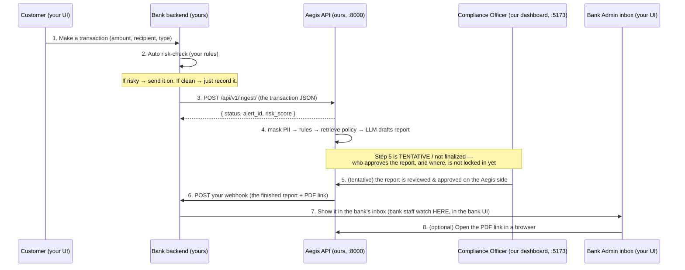

# Mock Bank — Build & Integration Brief

**Audience:** the teammate building the *mock bank* app. You do **not** need any prior
knowledge of our project — this document explains everything you need.

**Goal:** you build a small, self-contained "fake bank" app and send it to us as a ZIP.
We unzip it, run it on one laptop next to our system, and demonstrate the **whole
pipeline live**: a bank customer makes a transaction → the bank auto-flags it and sends
it to our system → our system drafts a regulator-ready report → our compliance officer
approves it → the finished report lands back in the bank's inbox.

Everything runs **locally on one laptop**. Nothing is deployed to the cloud.

> Three golden rules, read these first:
> 1. **The report is a legal filing for the regulator (FIU-India). The customer NEVER
>    sees it.** Telling a customer they've been reported is a crime ("tipping-off").
>    So: **no "send report to customer" feature anywhere.** The report only ever goes to
>    the *bank admin's* inbox.
> 2. **You never need our real API key while building.** Leave an empty placeholder for
>    it in your backend config (`AEGIS_API_KEY=` in `.env`). The Aegis team registers
>    your app and pastes the real key in *ourselves* after you send the ZIP — you never
>    receive or handle the secret. Wherever the key lives, it must be in your *backend*,
>    never in browser JavaScript. (More on this in Section 8.)
> 3. **Make it look like a real bank.** This isn't a bare form — it's a believable
>    banking website: a customer net-banking portal and an internal bank/compliance
>    console. Polished and professional enough to demo to outsiders. (See Section 6, Section 7.)

---

## Table of contents

- [0. TL;DR (the one-paragraph version)](#0-tldr)
- [1. What our system ("Aegis") is](#1-what-our-system-aegis-is)
- [2. The demo we are building together](#2-the-demo-we-are-building-together)
- [3. Scope: what YOU build vs what WE already built](#3-scope-what-you-build-vs-what-we-built)
  - [3.1 What you can hardcode or fake](#31-what-you-can-hardcode-or-fake)
  - [3.2 What you must build for real](#32-what-you-must-build-for-real)
- [4. How to structure your mock bank (architecture)](#4-how-to-structure-your-mock-bank)
- [5. The integration contract (the ONLY two connection points)](#5-the-integration-contract)
  - [5.1 Send a transaction to Aegis (Bank → Aegis)](#51-send-a-transaction-to-aegis-bank--aegis)
  - [5.2 Receive the finished report (Aegis → Bank)](#52-receive-the-finished-report-aegis--bank)
- [6. Build the Customer side](#6-build-the-customer-side)
- [7. Build the Bank-Admin side](#7-build-the-bank-admin-side)
  - [7.1 The bank AML rule engine (flag and forward)](#71-the-bank-aml-rule-engine-flag-and-forward)
  - [7.2 Best-practice advice](#72-best-practice-advice)
- [8. Config, ports & security rules](#8-config-ports--security-rules)
- [9. What to deliver (ZIP + README)](#9-what-to-deliver-zip--readme)
- [10. How WE will run it after you send the ZIP](#10-how-we-will-run-it-after-you-send-the-zip)
- [11. Definition of Done (acceptance checklist)](#11-definition-of-done)
- [Appendix A — Ready-to-use transaction payloads](#appendix-a--ready-to-use-transaction-payloads)
- [Appendix B — Exact webhook payload you will receive](#appendix-b--exact-webhook-payload-you-will-receive)
- [Appendix C — FAQ & gotchas](#appendix-c--faq--gotchas)
- [Appendix D — Full scenario matrix (cover all these)](#appendix-d--full-scenario-matrix-cover-all-these)
- [Appendix E — Copy-paste integration code (Node and Python)](#appendix-e--copy-paste-integration-code-node-and-python)

---

## 0. TL;DR

Build a fake bank with **two screens** and a **tiny backend**:
- **Customer screen** — a person fills in a transaction (amount, recipient, type) and clicks Send.
- **Bank-admin screen** — automatically risk-checks each transaction; risky ones are
  auto-sent to our API (`POST /api/v1/ingest/`); a list shows their status; an **inbox**
  shows the finished reports our system sends back (with a button to open the PDF).
- **Your backend** — holds the secret API key, sends flagged transactions to us, and
  exposes one URL that *receives* our finished report (a "webhook").

You do **not** build any AI, PII masking, report writing, or the approval screen — that's
our system. You only build the bank around it. Deliver a ZIP + a README with run steps.
Use any stack you like; keep ports off `5173` (see Section 8).

**Make it look like an actual bank** (real login, dashboard, balances, a proper transfer
flow; the admin side looks like an internal compliance console) — see Section 6/Section 7. And **don't
hardcode the bank's name/branding** — read it from config so it can be re-skinned later
for other banks/fintechs. You don't need our API key to build; you leave a blank slot for
it and we fill it in (see golden rule #2).

---

## 1. What our system ("Aegis") is

Banks and fintechs in India are legally required to file a **Suspicious Transaction
Report (STR)** — also called a SAR (Suspicious Activity Report) — with the financial
regulator (**FIU-India**) whenever they detect a suspicious transaction.

Writing that report by hand is slow and inconsistent. **Our system, Aegis, automates it:**

1. A bank sends us a flagged transaction (raw JSON).
2. Aegis **masks the personal data** (names, account numbers) so no private data leaks to
   the AI.
3. Aegis runs **rule checks** (e.g. "amount just under the reporting limit",
   "international wire", "dormant account suddenly active") to gather evidence.
4. Aegis retrieves the **bank's own AML policy** and asks an LLM to draft a report that
   **cites the relevant policy sections** (not generic text).
5. The drafted report is reviewed and approved on the Aegis side (today, by a compliance
   officer on the Aegis dashboard). **This approval step is not finalized** — exactly who
   approves, and where, may change. (It doesn't affect your build — see Section 2.)
6. On approval, Aegis builds a **regulator-formatted report (goAML JSON) + a PDF** and
   **sends it back to the bank**.

For this demo there is **no real bank**, so **your app plays the bank.** We provide
everything from step 2 to step 6. You provide steps 1 (sending the transaction) and the
final receiving/inbox part of step 6.

---

## 2. The demo we are building together



The single end-to-end story we will show on stage:

> "A customer sends ₹9,45,000 abroad. The bank's system instantly flags it and forwards
> it to Aegis. Seconds later a fully-drafted suspicious-transaction report appears in the
> compliance officer's queue, already citing the bank's AML policy. The officer approves
> it in one click — and the finished, regulator-ready report (with PDF) drops straight
> into the bank's inbox."

> **Note — not finalized:** *who* approves the report and *where* (step 5) is still being
> decided on the Aegis side, so treat it as tentative. **It does not change what you
> build.** The bank's staff watch their transactions in **your** bank UI (the monitoring
> list + inbox) — **not** in the Aegis UI. Your app only sends transactions and waits for
> the webhook; however the approval ends up working on our side, the webhook stays the
> trigger that drops the finished report into your inbox.

---

## 3. Scope: what YOU build vs what WE built

| Capability | Built by |
|---|---|
| Customer screen to create a transaction | **You** |
| Auto risk-check rules in the bank that decide "is this risky?" | **You** |
| Sending the flagged transaction to Aegis (`POST /api/v1/ingest/`) | **You** |
| A monitoring list (sent → processing → report received) | **You** |
| A webhook **receiver** endpoint that accepts our finished report | **You** |
| An **inbox** that displays the received report + opens the PDF | **You** |
| PII masking, rule engine, policy retrieval (RAG), LLM report drafting | **We** (done) |
| The report review/approve step on the Aegis side | **We** (tentative — not finalized) |
| Building the goAML report + PDF + sending the webhook | **We** (done) |

**You do NOT build:** any AI/LLM, any PII masking, the report itself, or the approval UI.
Treat Aegis as a black box with exactly two connection points (Section 5).

> **About the bank's AML _policy_ document (important — clears a common confusion):** the AML
> policy PDF that the SAR *cites* (e.g. "Section 4.1") is handled **entirely on the Aegis side** —
> Aegis stores and indexes it so the report can quote it. **You do not provide, upload, or
> reference any policy document.** Your only AML concern is the risk-**rule engine** in Section 7.1
> (which decides *whether to forward* a transaction). We index the policy on our side (already done
> for the demo tenant), so this never blocks your build. If a real bank's own policy is needed
> later, that's an Aegis-side step we run after your ZIP arrives.

### 3.1 What you can hardcode or fake

Keep it lean — none of these need to be "real". Faking them is expected:

| Area | Just fake it like this |
|---|---|
| Customer login / auth | A demo user, hardcoded credentials, or no login at all |
| Account balance | A static number, or decrement it naively after a transfer |
| Customers | One or two demo customers is enough (incl. **one "dormant" account** for rule R5) |
| Storage | In-memory, or a small SQLite file — no real database needed |
| Persistence across restarts | Not required |
| Account numbers / IBANs / device id / IP | Any plausible-looking strings; auto-generate them |
| Currency | INR only |
| HMAC signature check on the webhook | Skip it (optional hardening) |
| "File with FIU" / "Flag account" buttons | Cosmetic no-ops |
| Multiple banks / tenants | Just one bank; keep its name in `BANK_NAME` config for future reuse |
| Polling Aegis for status | Not needed — rely on the webhook |

### 3.2 What you must build for real

These are the spine of the demo — they must actually work:

- The **POST to Aegis** with the correct headers + body shape (Section 5.1).
- The bank's **AML rule engine** that decides forward-vs-clear (Section 7.1) — at least the rules
  needed to demo each case in Appendix D.
- The **webhook receiver** that returns `200` and stores the report (Section 5.2).
- The **monitoring list** status transitions and the **inbox** with a working **Open PDF**.
- The **two-tier split** with the **API key in the backend** (read from env, shipped blank).
- **Env-var config** + a `.env.example`.

---

## 4. How to structure your mock bank

Build it in **two tiers**. This is important — it's not optional decoration, it's what
keeps the API key safe and avoids browser security (CORS) problems.

```
  ┌──────────────────────────────┐         ┌───────────────────────────────┐
  │  Bank FRONTEND (browser UI)  │  HTTP   │  Bank BACKEND (your server)   │
  │  - Customer screen           │ ──────► │  - holds the AEGIS_API_KEY    │
  │  - Bank-admin screen + inbox │         │  - runs the risk rules        │
  │  Port: 5174 (or 3000)        │ ◄────── │  - POSTs flagged txns to Aegis│
  └──────────────────────────────┘         │  - receives Aegis's webhook   │
                                            │  - stores received reports    │
                                            │  Port: 8001                   │
                                            └───────────────┬───────────────┘
                                                            │  HTTP
                                            ┌───────────────▼───────────────┐
                                            │  AEGIS API (ours)  Port: 8000  │
                                            └────────────────────────────────┘
```

Why a backend and not just a frontend calling Aegis directly?
- **The API key must stay secret.** If the browser called Aegis directly, anyone could
  open dev-tools and steal the key. Your backend holds it; the browser never sees it.
- **Browser security (CORS).** Our API only accepts browser calls from a known list of
  origins. Server-to-server calls (your backend → Aegis) have no such restriction, so
  routing through your backend "just works".
- **The webhook needs a server.** Our system calls a URL on *your* side to deliver the
  finished report. Only a backend can listen for an incoming HTTP request; a browser
  cannot.

You can use **any stack** (Node/Express, Python/FastAPI or Flask, etc.). A single
full-stack framework (e.g. Next.js with API routes) is also fine, as long as the API key
and the webhook receiver live on the server side.

---

## 5. The integration contract

There are **exactly two** connection points. Get these right and everything works.

### 5.1 Send a transaction to Aegis (Bank → Aegis)

Your **backend** sends each flagged transaction to:

```
POST  http://localhost:8000/api/v1/ingest/
```

**Required headers** (all three):

| Header | Value | Notes |
|---|---|---|
| `Content-Type` | `application/json` | |
| `X-API-Key` | *(read from your backend env; you leave it blank, we paste it)* | the secret key — backend only |
| `X-Tenant-ID` | `TEN-0001` | identifies which bank you are |

Optional headers:

| Header | Purpose |
|---|---|
| `Idempotency-Key` | A unique string per transaction. If you resend the same one, Aegis returns `409` instead of creating a duplicate. If you omit it, Aegis hashes the body — so a byte-identical resend is still rejected. Best practice: send a fresh unique id (e.g. your transaction ref) per real transaction. |

> Your HTTP client must send a normal request with a `Content-Length` header (every
> standard library does this automatically for a JSON body). Do **not** use chunked
> transfer encoding. Max body size is **5 MB**.

**Request body** — must match the field layout below (this is the schema `TEN-0001` uses,
called `STANDARD_FINTECH`). Send exactly these nested keys:

```json
{
  "customer":     { "full_name": "Rohan Mehta", "id": "CUST-884213" },
  "account":      { "number": "5012-7788-2231" },
  "txn": {
    "ref_id":    "TXN-20260616-0001",
    "amount":    945000,
    "currency":  "INR",
    "type":      "INTERNATIONAL_WIRE",
    "direction": "OUTBOUND",
    "timestamp": "2026-04-16T11:42:07+05:30"
  },
  "counterparty": { "account": "AE070331234567", "name": "Gulf Horizon FZE", "bank": "Emirates NBD" },
  "metadata":     { "ip": "203.0.113.57", "device_id": "dev-9f3c1a77" },
  "risk":         { "score": 70, "reason": "Large outbound transfer just below threshold." }
}
```

**Full field reference** (what each key means and whether it matters):

| JSON path | Meaning | Required? |
|---|---|---|
| `customer.full_name` | Customer's name (will be masked by us) | Yes |
| `customer.id` | Your internal customer id | Recommended |
| `account.number` | Customer's account number (masked by us) | Recommended |
| `txn.ref_id` | Your unique transaction id | Recommended (use it as the `Idempotency-Key` too) |
| `txn.amount` | Numeric amount (no commas, no currency symbol) | **Yes** |
| `txn.currency` | e.g. `"INR"` | Recommended |
| `txn.type` | One of the types below | **Yes** |
| `txn.direction` | `"OUTBOUND"` / `"INBOUND"` (free text) | Optional |
| `txn.timestamp` | ISO-8601 datetime | Recommended |
| `counterparty.account` | The other party's account | Optional |
| `counterparty.name` | The other party's name | Optional |
| `counterparty.bank` | The other party's bank/institution | Optional (can trigger a rule, see below) |
| `metadata.ip` | Customer IP | Optional |
| `metadata.device_id` | Customer device id | Optional |
| `risk.score` | **Your** preliminary risk score, 0–100 | **Important** (see scoring below) |
| `risk.reason` | One-line reason your rules flagged it | Recommended (some text triggers rules) |

**Response** you get back immediately:

```json
{
  "status": "success",
  "alert_id": "f1e2d3c4-....-uuid",
  "risk_score": 100,
  "message": "Ingested successfully. SAR generation triggered."
}
```

- Save `alert_id` — it identifies this transaction inside Aegis; use it to track status in
  your monitoring list.
- If `message` says **"SAR generation triggered"**, a report is being drafted and you
  *will* receive a webhook later (after the officer approves). If it says **"No SAR
  required"**, Aegis judged it not suspicious enough and **no webhook will come** — show
  it as "cleared" in your UI.

**Status codes you may get back** (handle these in your backend):

| Code | Meaning | What you should do |
|---|---|---|
| `200` | Accepted | read `message` to set the row status (see above) |
| `400` | Bad JSON / not an object / no active schema | log it; it's a bug in your request shape |
| `401` | Bad/missing `X-API-Key` or `X-Tenant-ID` | check the key is set in your backend env |
| `409` | Duplicate (same `Idempotency-Key` / identical body) | treat as already-sent; don't resend |
| `411` | Missing `Content-Length` | use a normal JSON client (not chunked) |
| `413` | Body over 5 MB | shouldn't happen for a transaction |
| `429` | Rate limited (120 requests/min) | back off and retry after `Retry-After` seconds |

#### When does Aegis actually produce a report? (so your demo always works)

Aegis computes a **final score** and only drafts a report (and later sends you a webhook)
when that final score is **>= 75**. The math:

```
final_score = your risk.score (clamped to 0–100)
              + 20 for each HIGH-confidence rule that fires
              + 10 for each MEDIUM-confidence rule that fires
              (capped at 100)
```

The rules Aegis runs and what makes them fire:

| Rule | Fires when | Confidence |
|---|---|---|
| Structuring | `txn.amount` between **800,000 and 999,999** | HIGH if 900,000–999,999, else MEDIUM |
| High-risk type | `txn.type` is `INTERNATIONAL_WIRE`, `CRYPTO_PURCHASE`, `FOREX_TRANSFER`, or `HAWALA` | HIGH |
| Rapid movement | `txn.type` is `REVERSAL` or `REFUND` **and** amount > 100,000 | MEDIUM |
| Large round number | `txn.amount` is an exact multiple of 100,000 (e.g. 500000) | MEDIUM if >= 500,000 |
| Dormant activation | `risk.reason` text contains the word **"dormant"** | HIGH |
| High velocity | `risk.reason` contains **"velocity"**, or `risk.score` >= 90 | HIGH if score >= 90 |
| High-risk counterparty | `counterparty.bank` contains "Unknown Bank", "Shell Bank", "Offshore Co.", or "Anonymous" | MEDIUM |
| Risk-score threshold | `risk.score` >= 75 | HIGH if >= 85 |

**Easiest guarantees for the demo:**
- Send any transaction with **`risk.score` >= 75** → guaranteed report.
- Or send an `INTERNATIONAL_WIRE`/`HAWALA`/`CRYPTO_PURCHASE` with amount 900,000–999,999
  and `risk.score` 40+ → two HIGH rules (+40) → guaranteed report.
- To demo the **"clean / no report"** path, send e.g. `txn.type: "TRANSFER"`,
  `txn.amount: 25000`, `risk.score: 30` → final 30 → no report.

(Worked examples are in [Appendix A](#appendix-a--ready-to-use-transaction-payloads).)

> Your bank's own auto-flag rules decide **whether you send a transaction at all** — they
> can be as simple or fancy as you like (see the red-flag ideas in Section 7). Aegis then
> *independently* scores it. For a smooth demo, make the transactions you auto-send land
> in the "report" zone above.

### 5.2 Receive the finished report (Aegis → Bank)

After the compliance officer approves a draft on *our* dashboard, **Aegis sends an HTTP
POST to a URL on your backend** (the "webhook"). You decide the path; tell us what it is.
We suggest:

```
POST  http://localhost:8001/aegis/webhook
```

**You build this endpoint.** It should:
- Accept a JSON `POST`,
- Store the report (in memory, a file, or a small SQLite DB — your choice),
- Respond quickly with **HTTP 200** (so our "Test webhook" button shows success). We do
  not require any particular response body.

**Headers we send you:**

| Header | Value |
|---|---|
| `Content-Type` | `application/json` |
| `X-Aegis-Event` | `sar.approved` |
| `X-Aegis-Signature` | `sha256=<hmac>` — an HMAC-SHA256 of the raw body using a shared secret |

> **You do NOT need to verify the signature for the local demo.** It's there for
> production. (If you want to: HMAC-SHA256 the raw request body with the secret we give
> you and compare to the header. We can provide the secret on request.)

**Timing & retries:** the webhook fires **once**, the moment the officer clicks Approve on
our dashboard — which could be seconds to a few minutes after you sent the transaction.
There is **no automatic retry** and our call times out after ~8 seconds, so your receiver
should answer `200` quickly and not do slow work before responding. Keep the matching row
on `processing` until it arrives.

**Build your receiver before the full loop works:** we can fire a **test webhook** at your
URL on demand (from our dashboard's "Test webhook" button). The test payload is a
connectivity check and has a slightly different shape — e.g. `{"event": "...", "test": true,
"sar_id": "...", "narrative_text": "...", "compliance_rules_triggered": [...]}` — so write
your handler **defensively**: read fields with safe defaults and don't crash if `goaml_str`
or `pdf_url` is missing. Just store whatever arrives and return `200`.

**The JSON body we send** (this is the finished report — full real example in
[Appendix B](#appendix-b--exact-webhook-payload-you-will-receive)):

```json
{
  "event": "sar.approved",
  "sar_id": "9b2c....-uuid",
  "alert_id": "f1e2....-uuid",
  "approved_at": "2026-06-27T10:15:03.123Z",
  "approved_by": "Test Fintech Admin",
  "goaml_str": { "report": { "report_code": "STR", "...": "..." } },
  "pdf_url": "http://localhost:8000/files/sar/9b2c....-uuid.pdf",
  "compliance_rules_triggered": ["STRUCTURING", "HIGH_RISK_TYPE"]
}
```

What to do with the fields:
- `alert_id` — match it to the transaction in your monitoring list and flip its status to
  **"report received"**.
- `goaml_str` — the regulator-formatted report. Show its key fields in the inbox (it's a
  nested JSON object; see Appendix B for the shape). You don't have to render all of it —
  a few headline fields + "view raw JSON" is plenty.
- `pdf_url` — a direct link to the PDF. Put a **"Open PDF"** button that opens this URL in
  a new browser tab. (The PDF is served by *our* API, openly, on localhost.)
- `compliance_rules_triggered` — the list of rule codes that fired; show them as tags.

Optional extra actions the bank admin can have (cosmetic, no real effect): a **"File with
FIU"** button and a **"Flag account"** toggle. These are just bank-side UI; they do not
call us.

---

## 6. Build the Customer side

This is the **customer's net-banking portal** — it should look like a real bank's online
banking, not a bare form. Aim for a believable, professional look:
- A simple **login** (a demo customer is fine — no real auth needed).
- A **dashboard**: account number, a (fake) balance, recent transactions list, bank
  name/logo from config (don't hardcode).
- A **"New transfer / Send money"** flow that contains the transaction form below.
- Clean, modern styling (it's going on screen in front of people).

The transaction form itself:

**Fields:**
- Amount (number, INR)
- Recipient name + (optional) recipient account + (optional) recipient bank
- Transaction type — a dropdown. Include normal ones (`TRANSFER`, `DEPOSIT`,
  `WITHDRAWAL`) **and** the high-risk ones so the demo can trigger reports:
  `INTERNATIONAL_WIRE`, `CRYPTO_PURCHASE`, `FOREX_TRANSFER`, `HAWALA`, `REVERSAL`,
  `REFUND`.
- (optional) a "customer name" field, or hardcode a logged-in demo customer.

**Behavior:**
- On **Send**, call *your own backend* (not Aegis directly). Your backend records the
  transaction and runs the risk check (Section 7). Show the customer a normal confirmation like
  "Transaction submitted."
- **The customer must NEVER see anything about suspicion, reports, or flagging.** From the
  customer's point of view it's an ordinary transaction app. (This is the tipping-off
  rule.)

---

## 7. Build the Bank-Admin side

This is the **bank's internal compliance/monitoring console** — a separate, more
"operational" looking area from the customer portal (think an internal back-office tool:
data tables, filters, status badges). It has two parts: a **monitoring list** and an
**inbox**.

**Auto risk-check (your backend, on every transaction).** This is the bank's own AML
engine: when a customer's transaction *breaks* one or more rules, you score it, attach a
human-readable reason, and **auto-forward it to Aegis** (Section 5.1) — no human clicks. If it's
clean, store it locally and mark it "OK". Full design in **Section 7.1**; in one breath:

- Compute a `risk.score` (0–100) and a `risk.reason` from the rules in Section 7.1.
- **Forward to Aegis** if the score crosses your bank threshold (suggested **>= 50**);
  otherwise mark it cleared and don't send.
- Send your computed `risk.score` + `risk.reason` in the payload — Aegis re-scores
  independently, and your reason *text* can itself trigger Aegis rules (see Section 7.1).

**Monitoring list:** a table of forwarded transactions with a status that progresses:
```
sent  →  processing  →  report received
```
- `sent` once you POST to Aegis and get back an `alert_id`.
- `processing` while you wait (you can keep it on `processing` until the webhook arrives;
  you don't need to poll Aegis).
- `report received` when the webhook for that `alert_id` lands.

(If Aegis replied "No SAR required", mark that row **"cleared — no report"** and don't
expect a webhook.)

**Inbox:** a list of received reports. For each:
- Headline fields from `goaml_str.report` (report code = STR, the amount, the customer &
  counterparty names, the indicators, the approving officer, the date).
- The `compliance_rules_triggered` tags.
- An **"Open PDF"** button → opens `pdf_url` in a new tab.
- (optional) "View raw goAML JSON", "File with FIU", "Flag account".

### 7.1 The bank AML rule engine (flag and forward)

A transaction is "suspicious" when it **breaks an AML rule**. Implement the rules below in
your backend. They are deliberately **aligned with what Aegis checks**, so anything your
bank forwards as risky will reliably produce a report in the demo. For each rule that
matches, add points and append a reason.

| Bank rule | Condition (on the transaction) | What you set in the payload | Points | Aligns with Aegis rule |
|---|---|---|---|---|
| **R1 Structuring** | `amount` between **800,000 and 999,999** | `txn.amount` | **+60** | Structuring (HIGH if >= 900,000) |
| **R2 High-risk type** | `type` in `INTERNATIONAL_WIRE`, `CRYPTO_PURCHASE`, `FOREX_TRANSFER`, `HAWALA` | `txn.type` | **+60** | High-risk type (HIGH) |
| **R3 Rapid movement** | `type` in `REVERSAL`, `REFUND` **and** `amount` > 100,000 | `txn.type`, `txn.amount` | **+30** | Rapid movement (MEDIUM) |
| **R4 Round number** | `amount` >= 500,000 **and** a multiple of 100,000 | `txn.amount` | **+30** | Large round number (MEDIUM) |
| **R5 Dormant** | account is dormant | put the word **"dormant"** in `risk.reason` | **+60** | Dormant activation (HIGH) |
| **R6 Velocity** | **>= 5** txns from one account within 1 hour | put the word **"velocity"** in `risk.reason` | **+60** | High velocity (HIGH) |
| **R7 Counterparty** | counterparty bank in `Unknown Bank`, `Shell Bank`, `Offshore Co.`, `Anonymous` | `counterparty.bank` | **+30** | High-risk counterparty (MEDIUM) |

Reference implementation:

```python
def assess(txn, account, history):
    score, reasons = 0, []
    amt = txn.amount
    typ = txn.type.upper()

    # R1 Structuring — amount just below the 10,00,000 reporting threshold
    if 800000 <= amt <= 999999:
        score += 60; reasons.append("Amount just below the 10,00,000 reporting threshold (structuring)")

    # R2 High-risk instrument
    if typ in ("INTERNATIONAL_WIRE", "CRYPTO_PURCHASE", "FOREX_TRANSFER", "HAWALA"):
        score += 60; reasons.append(f"High-risk transaction type: {typ}")

    # R3 Rapid movement — large reversal/refund
    if typ in ("REVERSAL", "REFUND") and amt > 100000:
        score += 30; reasons.append("Large reversal/refund (rapid movement of funds)")

    # R4 Large round number
    if amt >= 500000 and amt % 100000 == 0:
        score += 30; reasons.append("Large round-number amount")

    # R5 Dormant account suddenly active  (the word "dormant" MUST be in the reason)
    if account.is_dormant:
        score += 60; reasons.append("Dormant account suddenly active")

    # R6 High velocity  (the word "velocity" MUST be in the reason)
    if history.count_last_hour(account) >= 5:
        score += 60; reasons.append("High velocity - multiple transactions in a short window")

    # R7 High-risk counterparty institution
    if txn.counterparty_bank in ("Unknown Bank", "Shell Bank", "Offshore Co.", "Anonymous"):
        score += 30; reasons.append("High-risk counterparty institution")

    score   = min(score, 100)
    forward = score >= 50                      # the bank's own forwarding threshold
    reason  = "; ".join(reasons) or "Routine transfer"
    return forward, score, reason
```

When `forward` is true, POST to Aegis (Section 5.1) with `risk.score = score` and
`risk.reason = reason`.

**Three alignment details — do not skip:**
1. **Words matter.** Aegis detects **dormant** and **velocity** by reading those *words*
   in `risk.reason` (velocity also fires automatically if `risk.score >= 90`). Keep the
   words in the reason for those cases.
2. **Aegis re-scores on its own** and adds points for the indicators it detects, so a
   single HIGH flag scored 60 by you becomes 60 + 20 = 80 in Aegis → a report. A single
   MEDIUM flag (30) won't even cross your forward threshold of 50, so it's cleared — that's
   correct and realistic (banks don't file on every round number).
3. **Structuring is HIGH only at >= 900,000.** A structuring amount of 800,000–899,999 is
   MEDIUM in Aegis (+10), so 60 + 10 = 70 < 75 → no report. Use **900,000–999,999** when
   you want structuring to reliably produce a report.

**State you need for two rules** (both fine in-memory):
- *Dormant (R5):* seed at least one account with `is_dormant = true` (a "dormant customer")
  so you can demo it.
- *Velocity (R6):* keep a per-account list of recent transaction timestamps and count how
  many fall in the last hour.

### 7.2 Best-practice advice

- **Unique `txn.ref_id` per transaction**, reused as the `Idempotency-Key` header — retries
  never create duplicates.
- **Never block the customer.** "Send" should feel instant: record the transaction, return
  success, and do the Aegis forward server-side (fire-and-forget or a tiny background job).
  The customer must never wait on — or see — anything AML-related.
- **Use the ingest response `message`** to set the row status: *"SAR generation triggered"*
  → `processing` (a webhook is coming); *"No SAR required"* → `cleared` (no webhook).
- **Degrade gracefully if Aegis is down:** keep the transaction recorded, mark the row
  "send failed — retry", offer a manual retry. Never crash the bank app.
- **Keep the webhook handler fast:** store the payload, return `200`, render separately.
- **Match on `alert_id`** to flip the correct monitoring-list row to "report received".
- **Send clean numbers:** `txn.amount` must be a plain number (no commas, no ₹) even if the
  UI shows "₹9,45,000". Timestamps in ISO-8601.
- **Seed a few demo transactions** at startup so the admin console isn't empty on stage.
- **Log** every outbound request and inbound webhook (console or file) — makes the live
  demo easy to narrate and debug.

---

## 8. Config, ports & security rules

**Ports (must follow):**

| Thing | Port | Who runs it |
|---|---|---|
| Aegis API | `8000` | us |
| Aegis dashboard (officer UI) | `5173` | us |
| **Your bank frontend** | **`5174`** (or `3000`) | you |
| **Your bank backend + webhook receiver** | **`8001`** | you |

- **Do not use `5173`** — that's our dashboard.
- Your **frontend** must run on `5174` or `3000` (these are the only extra origins our API
  allows browser calls from — relevant only if your frontend ever calls Aegis directly,
  which it shouldn't, but stay on these to be safe).
- Your **backend/webhook receiver** can be any free port; we suggest `8001`. (It receives
  server-to-server calls, so browser origin rules don't apply.)

**Make all URLs configurable via environment variables** (don't hardcode). At minimum:

| Env var | Example | Used by |
|---|---|---|
| `AEGIS_BASE_URL` | `http://localhost:8000` | your backend (where to send transactions) |
| `AEGIS_API_KEY` | *(leave blank — we paste it)* | your backend (secret) |
| `AEGIS_TENANT_ID` | `TEN-0001` | your backend |
| `BANK_BACKEND_PORT` | `8001` | your backend |
| `BANK_WEBHOOK_PATH` | `/aegis/webhook` | your backend (the receiver path) |
| `BANK_FRONTEND_PORT` | `5174` | your frontend |
| `BANK_NAME` | `Meridian Bank` (any) | branding shown in the UI (don't hardcode) |

Ship this as `.env.example` (copy to `.env` to run; we paste the key in):

```bash
# --- Aegis (our system) ---
AEGIS_BASE_URL=http://localhost:8000
AEGIS_API_KEY=                      # leave blank — the Aegis team fills this in
AEGIS_TENANT_ID=TEN-0001

# --- Your bank app ---
BANK_NAME=Meridian Bank
BANK_BACKEND_PORT=8001
BANK_WEBHOOK_PATH=/aegis/webhook    # your receiver is then http://localhost:8001/aegis/webhook
BANK_FRONTEND_PORT=5174
```

**About the API key:** you do **not** need it to build. Ship `.env` with `AEGIS_API_KEY=`
left **empty** and a matching `.env.example`. After you send us the ZIP, *we* register your
app on our side and paste the real key into your `.env` before running. Your code must read
the key from the env var (never inline it, never put it in the frontend). If at some point
you want to test the live send yourself, ping us and we'll issue a throwaway test key — but
the default plan is we fill it in.

**Security rules (important):**
- **Never put `AEGIS_API_KEY` in frontend / browser code.** Backend only.
- Your frontend talks to **your backend**; only **your backend** talks to **Aegis**.
- Don't commit real secrets to the ZIP; use `.env` + `.env.example`.

---

## 9. What to deliver (ZIP + README)

A single ZIP that runs **offline on one laptop**. Inside:

```
mock-bank/
├── README.md            # run steps (below) — REQUIRED
├── .env.example         # all the env vars from Section 8
├── frontend/            # customer + bank-admin UI
└── backend/             # API-key holder, risk rules, webhook receiver, storage
```

Your `README.md` must include:
1. **Prerequisites** (e.g. "Node 18+" or "Python 3.11+").
2. **Install** commands (e.g. `npm install` in `frontend/` and `backend/`).
3. **Configure**: copy `.env.example` → `.env`, and which value we (Aegis side) fill in.
4. **Run** commands — exact, copy-paste, to start the backend (`:8001`) and frontend
   (`:5174`). Ideally one command per tier.
5. **The webhook path** you chose (so we can point Aegis at it), e.g.
   `http://localhost:8001/aegis/webhook`.
6. A 3-line "how to demo" (open the customer page, send a transaction, watch the
   admin inbox).

Keep dependencies minimal and standard so it installs cleanly on our laptop without
special setup.

---

## 10. How WE will run it after you send the ZIP

This is the exact sequence we'll follow — build so this works on the first try:

1. **Start Aegis** (our side): API on `:8000`, dashboard on `:5173`.
2. **Unzip your app**, copy `.env.example` → `.env`, and **paste the real `AEGIS_API_KEY`**
   (revealed from our portal) into it. Then run your install + run steps from your README →
   your backend on `:8001`, your frontend on `:5174`.
3. **Point Aegis at your webhook** (our 1-minute step): we log into the Aegis dashboard as
   the bank admin → **Settings → Webhook** → set the callback URL to your webhook (e.g.
   `http://localhost:8001/aegis/webhook`), turn **off** "use internal sink", **Save**, then
   click **Test** (your receiver should answer 200).
4. **Run the loop:**
   - In your **customer** screen, send a transaction that lands in the report zone (e.g.
     `INTERNATIONAL_WIRE`, ₹9,45,000, `risk.score` 70).
   - Your **bank-admin** list shows it go `sent → processing`.
   - It appears in our **officer dashboard** queue with a policy-citing draft.
   - We click **Approve**.
   - Within a moment, your **inbox** shows the finished report; we click **Open PDF**.
5. Done — that's the full demo.

---

## 11. Definition of Done

Your build is "done" when all of these are true on a clean laptop:

- [ ] `npm install` / `pip install` (per your README) succeeds with no manual fixes.
- [ ] Frontend starts on `5174` (or `3000`); backend starts on `8001`.
- [ ] Customer can submit a transaction; it appears in the bank-admin list.
- [ ] Risky transactions are **auto-sent** to `POST http://localhost:8000/api/v1/ingest/`
      with the three required headers, and you store the returned `alert_id`.
- [ ] A clean transaction is **not** sent (or is shown as "cleared").
- [ ] Your webhook endpoint accepts our POST and returns **200**.
- [ ] When a report arrives, the matching list row flips to "report received" and the
      report appears in the **inbox** with an **Open PDF** button that opens `pdf_url`.
- [ ] The **API key is read from the backend env**, ships **blank** (`AEGIS_API_KEY=`),
      and is never in the browser — we paste the real value in.
- [ ] The **customer side never shows** any suspicion/report/flag information.
- [ ] It **looks like a real banking website** (customer portal + admin console), not a
      bare form; bank name/branding comes from `BANK_NAME` config, not hardcoded.
- [ ] All URLs/keys come from **env vars**; a `.env.example` is included.
- [ ] README has copy-paste run steps and states your webhook path.

---

## Appendix A — Ready-to-use transaction payloads

Send these to `POST http://localhost:8000/api/v1/ingest/` (with the 3 headers). Each is the
`STANDARD_FINTECH` shape.

**A1 — Guaranteed report (structuring + international wire), final score 100:**
```json
{
  "customer":     { "full_name": "Rohan Mehta", "id": "CUST-884213" },
  "account":      { "number": "5012-7788-2231" },
  "txn":          { "ref_id": "TXN-A1-0001", "amount": 945000, "currency": "INR",
                    "type": "INTERNATIONAL_WIRE", "direction": "OUTBOUND",
                    "timestamp": "2026-04-16T11:42:07+05:30" },
  "counterparty": { "account": "AE070331234567", "name": "Gulf Horizon FZE", "bank": "Emirates NBD" },
  "metadata":     { "ip": "203.0.113.57", "device_id": "dev-9f3c1a77" },
  "risk":         { "score": 70, "reason": "Large outbound transfer just below threshold." }
}
```
*Why: base 70 + structuring HIGH (+20) + high-risk type HIGH (+20) → capped 100 >= 75.*

**A2 — Guaranteed report (high risk score alone), final score ~95:**
```json
{
  "customer":     { "full_name": "Anjali Verma", "id": "CUST-771002" },
  "account":      { "number": "6644-1290-5521" },
  "txn":          { "ref_id": "TXN-A2-0001", "amount": 120000, "currency": "INR",
                    "type": "TRANSFER", "direction": "OUTBOUND",
                    "timestamp": "2026-05-02T09:10:00+05:30" },
  "counterparty": { "account": "1234567890", "name": "Quick Cash Traders", "bank": "HDFC Bank" },
  "metadata":     { "ip": "198.51.100.23", "device_id": "dev-aa11bb22" },
  "risk":         { "score": 92, "reason": "High velocity - 8 transactions in 1 hour." }
}
```
*Why: base 92 + velocity HIGH (+20) + risk-threshold HIGH (+20) → capped 100.*

**A3 — Clean / no report (to demo the negative path), final score 30:**
```json
{
  "customer":     { "full_name": "Sneha Iyer", "id": "CUST-330551" },
  "account":      { "number": "9001-2233-4455" },
  "txn":          { "ref_id": "TXN-A3-0001", "amount": 25000, "currency": "INR",
                    "type": "TRANSFER", "direction": "OUTBOUND",
                    "timestamp": "2026-05-03T14:00:00+05:30" },
  "counterparty": { "account": "5566778899", "name": "Ravi Kumar", "bank": "ICICI Bank" },
  "metadata":     { "ip": "203.0.113.9", "device_id": "dev-cc33dd44" },
  "risk":         { "score": 30, "reason": "Routine transfer." }
}
```
*Why: base 30, no rules fire → 30 < 75 → response says "No SAR required", no webhook.*

A quick test from a terminal (replace the key):
```bash
curl -X POST http://localhost:8000/api/v1/ingest/ \
  -H "Content-Type: application/json" \
  -H "X-API-Key: sk-ae-REPLACE_ME" \
  -H "X-Tenant-ID: TEN-0001" \
  -d @A1.json
```

---

## Appendix B — Exact webhook payload you will receive

This is the real shape Aegis POSTs to your webhook on approval (values illustrative):

```json
{
  "event": "sar.approved",
  "sar_id": "9b2c8f1a-7e44-4c2b-9a10-2f3d4e5a6b7c",
  "alert_id": "f1e2d3c4-1122-3344-5566-77889900aabb",
  "approved_at": "2026-06-27T10:15:03.123456Z",
  "approved_by": "Test Fintech Admin",
  "compliance_rules_triggered": ["STRUCTURING", "HIGH_RISK_TYPE"],
  "pdf_url": "http://localhost:8000/files/sar/9b2c8f1a-7e44-4c2b-9a10-2f3d4e5a6b7c.pdf",
  "goaml_str": {
    "report": {
      "rentity_id": "TEN-0001",
      "rentity_name": "Test Fintech Pvt Ltd",
      "submission_code": "E",
      "report_code": "STR",
      "entity_reference": "9b2c8f1a-7e44-4c2b-9a10-2f3d4e5a6b7c",
      "submission_date": "2026-06-27T10:15:03.123456Z",
      "currency_code_local": "INR",
      "reporting_person": { "name": "Test Fintech Admin" },
      "report_indicators": ["STRUCTURING_BELOW_THRESHOLD", "HIGH_RISK_INSTRUMENT"],
      "reason": "On 2026-04-16, customer Rohan Mehta initiated an outbound international wire of INR 945,000 ... (full narrative, with real names, citing the bank's AML policy sections).",
      "action": "File STR with FIU-IND and place a temporary hold on the account pending review.",
      "transaction": {
        "transactionnumber": "TXN-A1-0001",
        "date_transaction": "2026-04-16T11:42:07+05:30",
        "value_local": 945000.0,
        "transmode_code": "TT",
        "transaction_description": "INTERNATIONAL_WIRE OUTBOUND",
        "t_from_my_client": {
          "from_funds_code": "K",
          "from_account": { "institution_name": "Test Fintech Pvt Ltd", "account": "5012-7788-2231" },
          "from_person": { "name": "Rohan Mehta", "client_ref": "CUST-884213" }
        },
        "t_to": {
          "to_funds_code": "K",
          "to_account": { "institution_name": "Emirates NBD", "account": "AE070331234567" },
          "to_person": { "name": "Gulf Horizon FZE" }
        }
      }
    }
  }
}
```

Notes:
- `goaml_str.report.reason` is the full report narrative (with **real** customer names —
  it's the bank's own customer, so that's expected and legal). This is what gets filed.
- `pdf_url` may occasionally be `null` if PDF rendering failed on our side — handle that
  by showing the JSON without the PDF button. (In practice it'll be present.)
- For the demo you only need to *display* this; you don't process it further.

---

## Appendix C — FAQ & gotchas

**Q: Do I poll Aegis to know when the report is ready?**
No. Just wait for the webhook. Keep the row on "processing" until it arrives. (Polling is
possible but unnecessary for the demo.)

**Q: I sent a transaction but no webhook came.**
Three usual reasons: (1) the transaction scored below 75 so no report was made — check the
ingest response `message`; (2) the officer hasn't approved it yet on our dashboard — the
webhook fires **only on approval**; (3) our webhook URL isn't pointed at your receiver yet
(our step in Section 10.3). It is **not** your bug if (1) or (2).

**Q: Can my frontend call Aegis directly?**
Don't. Route through your backend (keeps the key secret + avoids CORS). Your frontend only
talks to your backend.

**Q: Does my webhook need to verify the HMAC signature?**
Not for the local demo. Optional hardening only.

**Q: What HTTP status should my webhook return?**
`200` (any 2xx). Return it promptly; don't do slow work before responding.

**Q: What if I send the same transaction twice?**
Aegis rejects the duplicate with `409`. Send a unique `txn.ref_id` (and ideally an
`Idempotency-Key`) per real transaction.

**Q: Which transaction types trigger a report?**
The high-risk ones (`INTERNATIONAL_WIRE`, `CRYPTO_PURCHASE`, `FOREX_TRANSFER`, `HAWALA`)
each add a strong signal. See the scoring table in Section 5.1 and the examples in Appendix A.

**Q: Stack — Node or Python?**
Your choice. Just keep the two-tier structure, the env-var config, ports off 5173, and a
clean README.

---

## Appendix D — Full scenario matrix (cover all these)

Make sure a person at the demo can produce each of these from the customer screen (or a
seeded "demo" button). Assumes the Section 7.1 engine (HIGH = +60, MEDIUM = +30, forward at >= 50).
"Forwarded?" = does your bank send it to Aegis. "Report?" = does Aegis draft a SAR (and
therefore send you a webhook).

| # | Case | Customer action | Forwarded? | Report? | Why |
|---|---|---|---|---|---|
| 1 | **Structuring** | Transfer **9,45,000** | Yes (60) | **Yes** | Aegis 60 + structuring HIGH 20 = 80 |
| 2 | **International wire** | Intl wire 3,00,000 | Yes (60) | **Yes** | 60 + high-risk HIGH 20 = 80 |
| 3 | **Crypto purchase** | Crypto 2,00,000 | Yes (60) | **Yes** | 60 + high-risk HIGH 20 = 80 |
| 4 | **Hawala** | Hawala 1,50,000 | Yes (60) | **Yes** | 60 + high-risk HIGH 20 = 80 |
| 5 | **Rapid movement** | **Refund 5,00,000** (also round) | Yes (30+30=60) | **Yes** | 60 + rapid 10 + round 10 = 80 |
| 6 | **Round number only** | Transfer 5,00,000 | No (30 < 50) | — | below the bank's forward threshold (realistic) |
| 7 | **Dormant** | Transfer from the seeded **dormant** account | Yes (60) | **Yes** | 60 + dormant HIGH 20 = 80 |
| 8 | **Velocity** | **5+ transfers** within a minute from one account | Yes (60) | **Yes** | 60 + velocity HIGH 20 = 80 |
| 9 | **Counterparty only** | Transfer to **"Shell Bank"** 2,00,000 | No (30 < 50) | — | pair with another flag to forward |
| 10 | **Clean** | Transfer 25,000 to a normal bank | No | — | nothing fires → show "cleared — no report" |
| 11 | **Duplicate** | Re-send the same `txn.ref_id` | (already sent) | — | Aegis returns `409`; bank handles it gracefully |

**Reliable demo set:** cases **1, 2, 3, 4, 5, 7, 8** are your guaranteed "full loop →
report in the inbox" demos. **Case 10** is your guaranteed "clean, nothing happens" demo.
**Case 6** is a great talking point ("the system correctly decides this isn't worth a
filing"). **Cases 9 and 11** show the bank's own logic (combine flags / reject duplicates).

To force a report for any "—" case, either combine it with another flag or let your bank
score push `risk.score` to **>= 75** (which alone guarantees an Aegis report).

---

## Appendix E — Copy-paste integration code (Node and Python)

Skeletons for the two touchpoints. Shapes match Section 5.1, Section 5.2 and Appendix B
exactly — wire them to your storage and UI.

### E1. Send a transaction to Aegis (from your backend)

**Node (18+, built-in `fetch`):**
```js
async function sendToAegis(txn) {
  const res = await fetch(`${process.env.AEGIS_BASE_URL}/api/v1/ingest/`, {
    method: "POST",
    headers: {
      "Content-Type": "application/json",
      "X-API-Key": process.env.AEGIS_API_KEY,
      "X-Tenant-ID": process.env.AEGIS_TENANT_ID,
      "Idempotency-Key": txn.refId,                 // unique per transaction
    },
    body: JSON.stringify({
      customer:     { full_name: txn.customerName, id: txn.customerId },
      account:      { number: txn.accountNumber },
      txn:          { ref_id: txn.refId, amount: txn.amount, currency: "INR",
                      type: txn.type, direction: "OUTBOUND",
                      timestamp: new Date().toISOString() },
      counterparty: { account: txn.cpAccount, name: txn.cpName, bank: txn.cpBank },
      metadata:     { ip: txn.ip, device_id: txn.deviceId },
      risk:         { score: txn.riskScore, reason: txn.riskReason },
    }),
  });
  if (res.status === 409) return { duplicate: true };       // already sent
  if (!res.ok) throw new Error(`Aegis ingest failed: ${res.status}`);
  return await res.json();   // { status, alert_id, risk_score, message }
}
```

**Python (`requests`):**
```python
import os, requests

def send_to_aegis(txn):
    r = requests.post(
        f"{os.environ['AEGIS_BASE_URL']}/api/v1/ingest/",
        headers={
            "Content-Type": "application/json",
            "X-API-Key": os.environ["AEGIS_API_KEY"],
            "X-Tenant-ID": os.environ["AEGIS_TENANT_ID"],
            "Idempotency-Key": txn["ref_id"],
        },
        json={
            "customer":     {"full_name": txn["customer_name"], "id": txn["customer_id"]},
            "account":      {"number": txn["account_number"]},
            "txn":          {"ref_id": txn["ref_id"], "amount": txn["amount"], "currency": "INR",
                             "type": txn["type"], "direction": "OUTBOUND",
                             "timestamp": txn["timestamp"]},
            "counterparty": {"account": txn["cp_account"], "name": txn["cp_name"], "bank": txn["cp_bank"]},
            "metadata":     {"ip": txn["ip"], "device_id": txn["device_id"]},
            "risk":         {"score": txn["risk_score"], "reason": txn["risk_reason"]},
        },
        timeout=10,
    )
    if r.status_code == 409:
        return {"duplicate": True}
    r.raise_for_status()
    return r.json()   # { status, alert_id, risk_score, message }
```

### E2. Receive the report (your webhook endpoint)

**Node (Express):**
```js
const express = require("express");
const app = express();
app.use(express.json());

const reports = [];   // your inbox store (in-memory is fine)

app.post(process.env.BANK_WEBHOOK_PATH || "/aegis/webhook", (req, res) => {
  const b = req.body || {};
  // defensive: the connectivity-test payload has fewer fields
  reports.push({
    alertId: b.alert_id, sarId: b.sar_id,
    goaml: b.goaml_str || null, pdfUrl: b.pdf_url || null,
    rules: b.compliance_rules_triggered || [], receivedAt: new Date().toISOString(),
  });
  // TODO: flip the matching monitoring-list row (by alertId) to "report received"
  res.sendStatus(200);                 // answer fast
});

app.listen(process.env.BANK_BACKEND_PORT || 8001);
```

**Python (FastAPI):**
```python
from fastapi import FastAPI, Request
app = FastAPI()
reports = []   # your inbox store

@app.post("/aegis/webhook")
async def aegis_webhook(req: Request):
    b = await req.json()
    reports.append({
        "alert_id": b.get("alert_id"), "sar_id": b.get("sar_id"),
        "goaml": b.get("goaml_str"), "pdf_url": b.get("pdf_url"),
        "rules": b.get("compliance_rules_triggered", []),
    })
    # TODO: flip the matching monitoring-list row to "report received"
    return {"ok": True}   # any 2xx
```

---

*Questions while building? Ping us. When you're done, zip `mock-bank/` and send it over —
we'll wire the webhook and run the full demo from your README.*
